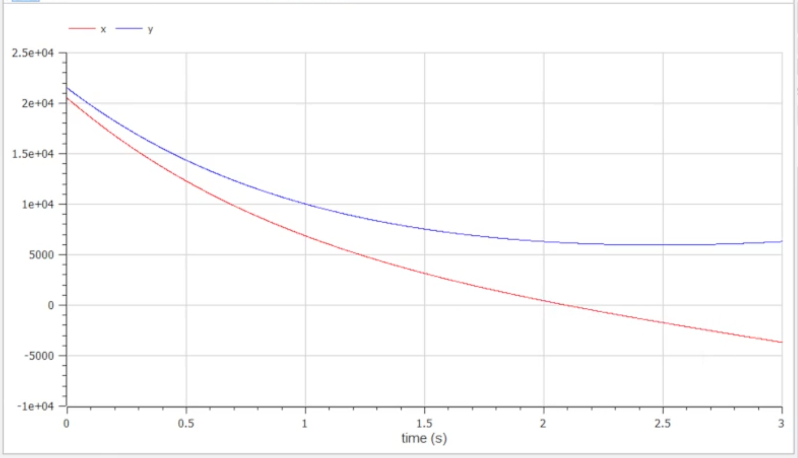
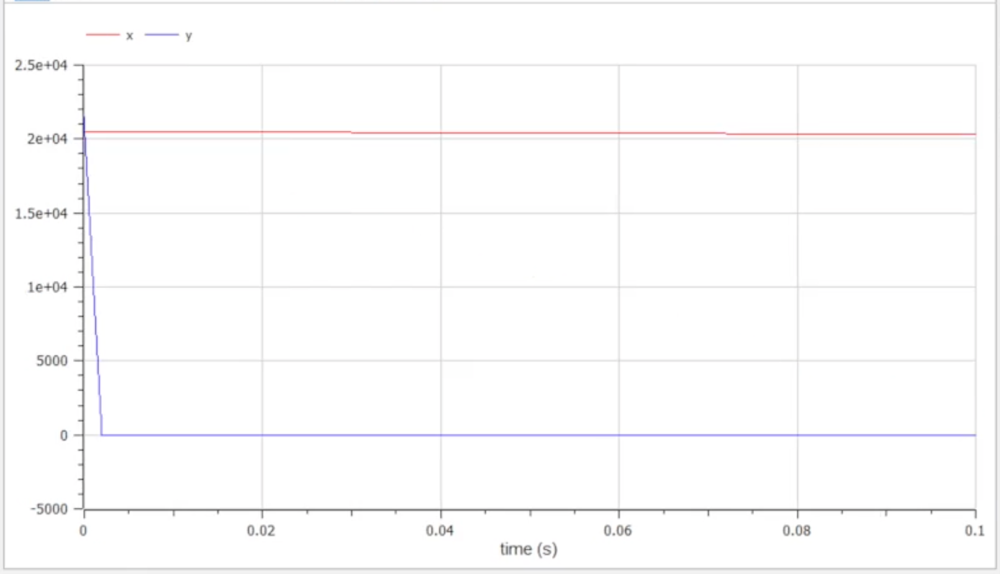

---
# Front matter
title: "Презентация о выполнении лабораторной работы №3"
subtitle: "Построение моделей Ланчестера"
author: "Евсеева Дарья Олеговна"
group: "НФИбд-01-19"
institute: "Российский Университет Дружбы Народов, Москва, Россия"
teacher: "Дмитрий Сергеевич Кулябов"
date: "25 февраля, 2022"

# Generic options
lang: ru-RU
toc-title: "Содержание"

# Bibliography
bibliography: bib/cite.bib
csl: pandoc/csl/gost-r-7-0-5-2008-numeric.csl

# Pdf output format
toc: true # Table of contents
toc_depth: 2
fontsize: 12pt
linestretch: 1.5
papersize: a4
documentclass: scrreprt
## I18n
polyglossia-lang:
  name: russian
  options:
	- spelling=modern
	- babelshorthands=true
polyglossia-otherlangs:
  name: english
### Fonts
mainfont: PT Serif
romanfont: PT Serif
sansfont: PT Sans
monofont: PT Mono
mainfontoptions: Ligatures=TeX
romanfontoptions: Ligatures=TeX
sansfontoptions: Ligatures=TeX,Scale=MatchLowercase
monofontoptions: Scale=MatchLowercase,Scale=0.9
## Biblatex
biblatex: true
biblio-style: "gost-numeric"
biblatexoptions:
  - parentracker=true
  - backend=biber
  - hyperref=auto
  - language=auto
  - autolang=other*
  - citestyle=gost-numeric
## Misc options
indent: true
header-includes:
  - \linepenalty=10 # the penalty added to the badness of each line within a paragraph (no associated penalty node) Increasing the value makes tex try to have fewer lines in the paragraph.
  - \interlinepenalty=0 # value of the penalty (node) added after each line of a paragraph.
  - \hyphenpenalty=50 # the penalty for line breaking at an automatically inserted hyphen
  - \exhyphenpenalty=50 # the penalty for line breaking at an explicit hyphen
  - \binoppenalty=700 # the penalty for breaking a line at a binary operator
  - \relpenalty=500 # the penalty for breaking a line at a relation
  - \clubpenalty=150 # extra penalty for breaking after first line of a paragraph
  - \widowpenalty=150 # extra penalty for breaking before last line of a paragraph
  - \displaywidowpenalty=50 # extra penalty for breaking before last line before a display math
  - \brokenpenalty=100 # extra penalty for page breaking after a hyphenated line
  - \predisplaypenalty=10000 # penalty for breaking before a display
  - \postdisplaypenalty=0 # penalty for breaking after a display
  - \floatingpenalty = 20000 # penalty for splitting an insertion (can only be split footnote in standard LaTeX)
  - \raggedbottom # or \flushbottom
  - \usepackage{float} # keep figures where there are in the text
  - \floatplacement{figure}{H} # keep figures where there are in the text
---

# Прагматика выполнения

Задачи математического моделирования являются широко распространенными, и навыки их решения могут быть очень полезны в нашей будущей профессии. Также, среда OpenModelica является одним из самых подходящих по функциональным возможностям средств для решения подобных задач, и опыт работы в ней также будет полезен.

# Цель работы

Целью данной работы является построение моделей Ланчестера --- простейших моделей боевых действий --- в среде OpenModelica.

# Задачи выполнения

Были даны условия задачи (вариант №21):

Между страной $X$ и страной $Y$ идет война. Численность состава войск исчисляется от начала войны, и являются временными функциями $x(t)$ и $y(t)$. В начальный момент времени страна $X$ имеет армию численностью 20 500 человек, а в распоряжении страны $Y$ армия численностью в 21 500 человек. Для упрощения модели считаем, что коэффициенты $a$, $b$, $c$, $h$ постоянны. Также считаем $P(t)$ и $Q(t)$ непрерывные функции.

В ходе лабораторной работы было необходимо построить графики изменения численности войск армии $X$ и армии $Y$ для двух случаев:

1. Модель боевых действий между регулярными войсками $$\frac{dx}{dt}=-0.21x(t)-0.74y(t)+sin(t)+0.5$$ $$\frac{dy}{dt}=-0.68x(t)-0.19y(t)+cos(t)+0.5$$
2. Модель ведения боевых действий с участием регулярных войск и
партизанских отрядов $$\frac{dx}{dt}=-0.09x(t)-0.79y(t)+sin(2t)$$ $$\frac{dy}{dt}=-0.62x(t)y(t)-0.11y(t)+cos(2t)$$

# Результаты выполнения

В ходе работы мы выполнили все поставленные задачи, а именно получили графики изменения численности войск армий для двух случаев:

1. Модель боевых действий между регулярными войсками

{ #fig:001 width=70% }

2. Модель ведения боевых действий с участием регулярных войск и
партизанских отрядов

{ #fig:001 width=70% }

В результате проделанной работы мы научились строить математические модели Ланчестера с использованием среды OpenModelica.

::: {#refs}
:::
