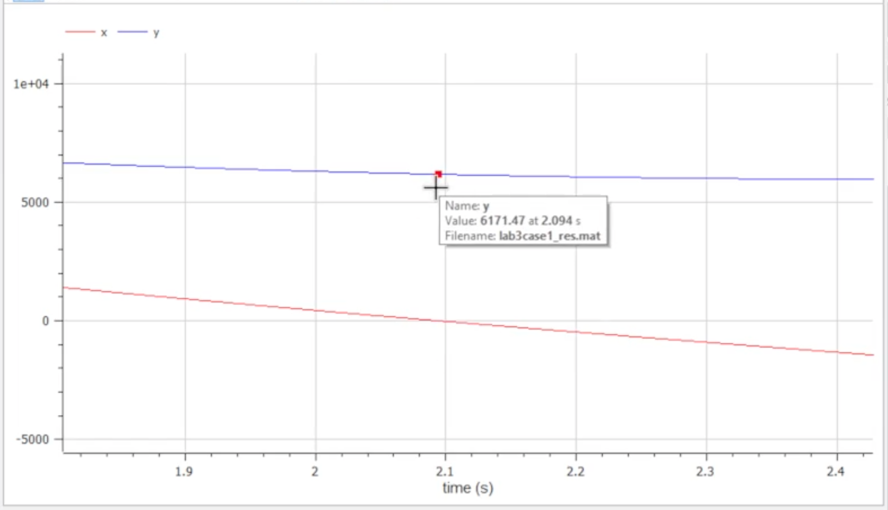
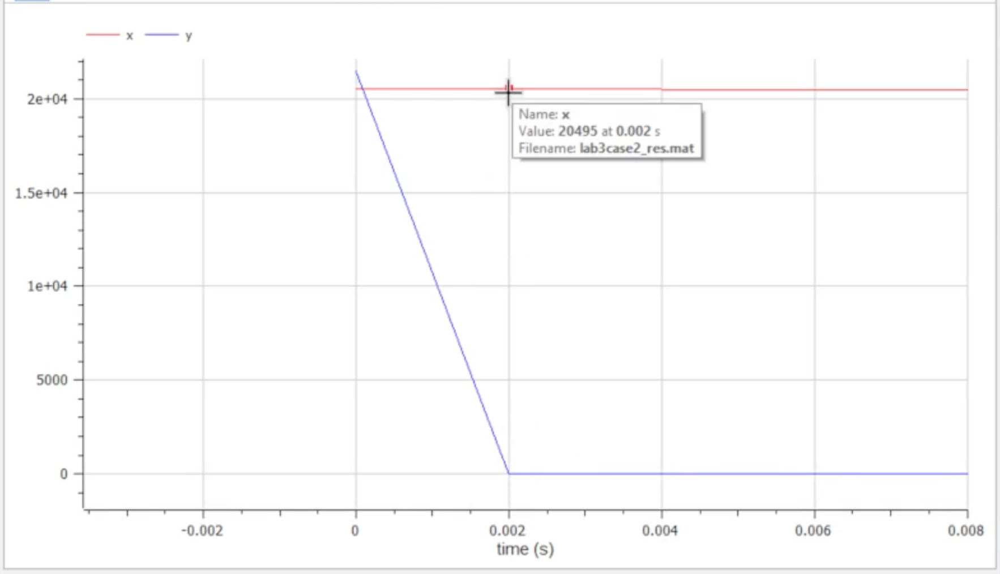

---
# Front matter
title: "Отчет по лабораторной работе №3"
subtitle: "Построение моделей Ланчестера"
author: "Евсеева Дарья Олеговна"
group: "НФИбд-01-19"
institute: "Российский Университет Дружбы Народов, Москва, Россия"
teacher: "Дмитрий Сергеевич Кулябов"
date: "25 февраля, 2022"

# Generic options
lang: ru-RU
toc-title: "Содержание"

# Bibliography
bibliography: bib/cite.bib
csl: pandoc/csl/gost-r-7-0-5-2008-numeric.csl

# Pdf output format
toc: true # Table of contents
toc_depth: 2
lof: true # List of figures
lot: true # List of tables
fontsize: 12pt
linestretch: 1.5
papersize: a4
documentclass: scrreprt
## I18n
polyglossia-lang:
  name: russian
  options:
	- spelling=modern
	- babelshorthands=true
polyglossia-otherlangs:
  name: english
### Fonts
mainfont: PT Serif
romanfont: PT Serif
sansfont: PT Sans
monofont: PT Mono
mainfontoptions: Ligatures=TeX
romanfontoptions: Ligatures=TeX
sansfontoptions: Ligatures=TeX,Scale=MatchLowercase
monofontoptions: Scale=MatchLowercase,Scale=0.9
## Biblatex
biblatex: true
biblio-style: "gost-numeric"
biblatexoptions:
  - parentracker=true
  - backend=biber
  - hyperref=auto
  - language=auto
  - autolang=other*
  - citestyle=gost-numeric
## Misc options
indent: true
header-includes:
  - \linepenalty=10 # the penalty added to the badness of each line within a paragraph (no associated penalty node) Increasing the value makes tex try to have fewer lines in the paragraph.
  - \interlinepenalty=0 # value of the penalty (node) added after each line of a paragraph.
  - \hyphenpenalty=50 # the penalty for line breaking at an automatically inserted hyphen
  - \exhyphenpenalty=50 # the penalty for line breaking at an explicit hyphen
  - \binoppenalty=700 # the penalty for breaking a line at a binary operator
  - \relpenalty=500 # the penalty for breaking a line at a relation
  - \clubpenalty=150 # extra penalty for breaking after first line of a paragraph
  - \widowpenalty=150 # extra penalty for breaking before last line of a paragraph
  - \displaywidowpenalty=50 # extra penalty for breaking before last line before a display math
  - \brokenpenalty=100 # extra penalty for page breaking after a hyphenated line
  - \predisplaypenalty=10000 # penalty for breaking before a display
  - \postdisplaypenalty=0 # penalty for breaking after a display
  - \floatingpenalty = 20000 # penalty for splitting an insertion (can only be split footnote in standard LaTeX)
  - \raggedbottom # or \flushbottom
  - \usepackage{float} # keep figures where there are in the text
  - \floatplacement{figure}{H} # keep figures where there are in the text
---

# Цель работы

Целью данной работы является построение моделей Ланчестера --- простейших моделей боевых действий --- в среде OpenModelica.

# Задание

Даны условия задачи (вариант №21):

Между страной $X$ и страной $Y$ идет война. Численность состава войск исчисляется от начала войны, и являются временными функциями $x(t)$ и $y(t)$. В начальный момент времени страна $X$ имеет армию численностью 20 500 человек, а в распоряжении страны $Y$ армия численностью в 21 500 человек. Для упрощения модели считаем, что коэффициенты $a$, $b$, $c$, $h$ постоянны. Также считаем $P(t)$ и $Q(t)$ непрерывные функции.

Необходимо построить графики изменения численности войск армии $X$ и армии $Y$ для следующих случаев:

1. Модель боевых действий между регулярными войсками $$\frac{dx}{dt}=-0.21x(t)-0.74y(t)+sin(t)+0.5$$ $$\frac{dy}{dt}=-0.68x(t)-0.19y(t)+cos(t)+0.5$$
2. Модель ведения боевых действий с участием регулярных войск и
партизанских отрядов $$\frac{dx}{dt}=-0.09x(t)-0.79y(t)+sin(2t)$$ $$\frac{dy}{dt}=-0.62x(t)y(t)-0.11y(t)+cos(2t)$$

# Теоретическое введение

OpenModelica --- свободное открытое программное обеспечение для моделирования, симуляции, оптимизации и анализа сложных динамических систем. Основано на языке Modelica.

Рассмотрим некоторые простейшие модели боевых действий --- модели Ланчестера. В противоборстве могут принимать участие как регулярные войска, так и партизанские отряды. В общем случае главной характеристикой соперников являются численности сторон. Если в какой-то момент времени одна из численностей обращается в нуль, то данная сторона считается проигравшей (при условии, что численность другой стороны в данный момент положительна).

Рассмотрим три случая ведения боевых действий:

1. Боевые действия между регулярными войсками
2. Боевые действия с участием регулярных войск и партизанских отрядов
3. Боевые действия между партизанскими отрядами

В первом случае численность регулярных войск определяется тремя факторами:

 - скорость уменьшения численности войск из-за причин, не связанных с боевыми действиями (болезни, травмы, дезертирство);
 - cкорость потерь, обусловленных боевыми действиями противоборствующих сторон (что связанно с качеством стратегии, уровнем вооружения, профессионализмом солдат и т.п.);
 - cкорость поступления подкрепления (задаётся некоторой функцией от времени).

В этом случае модель боевых действий между регулярными войсками описывается следующим образом:

$$\frac{dx}{dt}=-a(t)x(t)-b(t)y(t)+P(t)$$
$$\frac{dy}{dt}=-c(t)x(t)-h(t)y(t)+Q(t)$$

Потери, не связанные с боевыми действиями, описывают члены $-a(t)x(t)$ и $-h(t)y(t)$, члены $-b(t)y(t)$ и $-c(t)x(t)$ отражают потери на поле боя.

Коэффициенты $b(t)$ и $c(t)$ указывают на эффективность боевых действий со стороны $у$ и $х$ соответственно, $a(t)$, $h(t)$ - величины, характеризующие степень влияния различных факторов на потери. Функции $P(t)$, $Q(t)$ учитывают возможность подхода подкрепления к войскам $X$ и $Y$ в течение одного дня.

Во втором случае в борьбу добавляются партизанские отряды. Нерегулярные войска, в отличие от постоянной армии, менее уязвимы, так как действуют скрытно, в этом случае сопернику приходится действовать неизбирательно, по площадям, занимаемым партизанами. Поэтому считается, что темп потерь партизан, проводящих свои операции в разных местах на некоторой известной территории, пропорционален не только численности армейских соединений, но и численности самих партизан.

В результате модель принимает вид:

$$\frac{dx}{dt}=-a(t)x(t)-b(t)y(t)+P(t)$$
$$\frac{dy}{dt}=-c(t)x(t)y(t)-h(t)y(t)+Q(t)$$

В этой системе все величины имеют тот же смысл, что и в системе в первом случае.

Модель ведения боевых действий между партизанскими отрядами с учетом предположений, сделанных в предыдущем случаем, имеет вид:

$$\frac{dx}{dt}=-a(t)x(t)-b(t)x(t)y(t)+P(t)$$
$$\frac{dy}{dt}=-h(t)y(t)-c(t)x(t)y(t)+Q(t)$$

# Выполнение лабораторной работы

## 1. Написание заготовки для построения моделей

Напишем основу программы для построения требуемых моделей. Работу будем выполнять в среде OpenModelica.

Определим необходимые переменные и параметры и обозначим начальные условия.

{ #fig:001 width=70% }

## 2. Построение модели боевых действий между регулярными войсками

Дополним код заготовки программы в соответствии с данными задачи для того, чтобы построить модель боевых действий между регулярными войсками.

Зададим уравнения и значения для коэффициентов и начальных данных.

{ #fig:001 width=70% }

Запустим симуляцию и отобразим на графике значения переменных $x$ и $y$.

{ #fig:001 width=70% }

Из графика можно видеть, что победителем битвы станет армия $y$.

Приблизим часть графика, в которой численность армии $x$ достигает $0$, и посмотрим на примерное значение численности армии победителя $y$.

{ #fig:001 width=70% }

## 3. Построение модели боевых действий с участием регулярных войск и партизанских отрядов

Теперь дополним код заготовки программы в соответствии с данными задачи для того, чтобы построить модель боевых действий с участием регулярных войск и партизанских отрядов.

Зададим уравнения и значения для коэффициентов и начальных данных.

{ #fig:001 width=70% }

Запустим симуляцию и отобразим на графике значения переменных $x$ и $y$.

{ #fig:001 width=70% }

Из графика можно видеть, что победителем битвы станет армия $x$.

Приблизим часть графика, в которой численность армии $y$ достигает $0$, и посмотрим на примерное значение численности армии победителя $x$.

{ #fig:001 width=70% }

# Выводы

В результате проделанной работы мы научились строить математические модели Ланчестера с использованием среды OpenModelica.

# Список литературы{.unnumbered}

- Методические материалы к лабораторной работе, представленные на сайте "ТУИС РУДН" https://esystem.rudn.ru/
- Документация OpenModelica https://www.openmodelica.org/doc/OpenModelicaUsersGuide/latest/

::: {#refs}
:::
