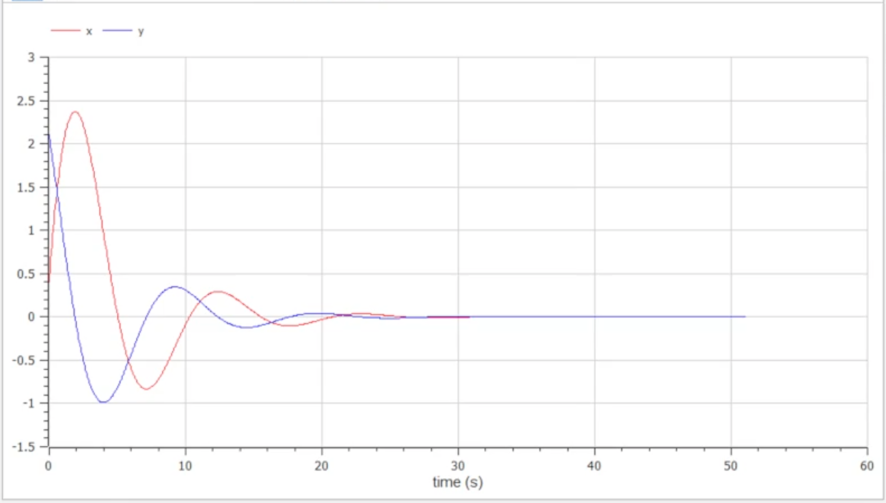
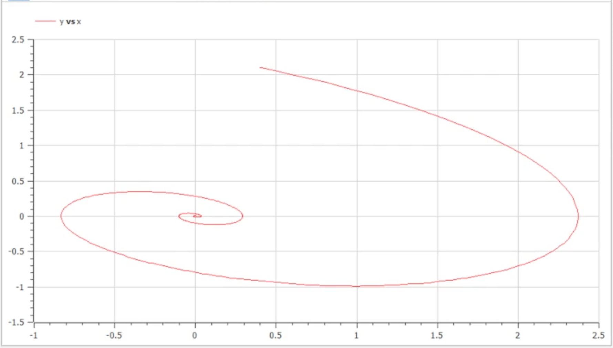
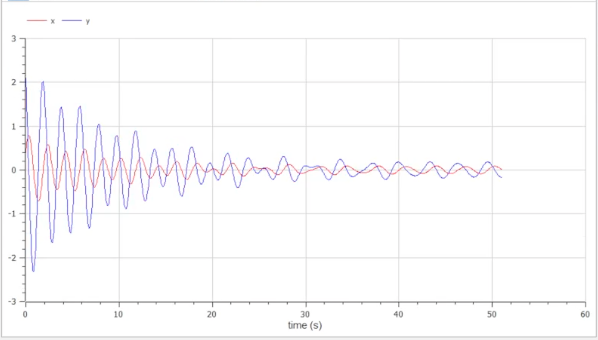

---
# Front matter
title: "Отчет по лабораторной работе №4"
subtitle: "Построение моделей гармонических колебаний"
author: "Евсеева Дарья Олеговна"
group: "НФИбд-01-19"
institute: "Российский Университет Дружбы Народов, Москва, Россия"
teacher: "Дмитрий Сергеевич Кулябов"
date: "4 марта, 2022"

# Generic options
lang: ru-RU
toc-title: "Содержание"

# Bibliography
bibliography: bib/cite.bib
csl: pandoc/csl/gost-r-7-0-5-2008-numeric.csl

# Pdf output format
toc: true # Table of contents
toc_depth: 2
lof: true # List of figures
lot: true # List of tables
fontsize: 12pt
linestretch: 1.5
papersize: a4
documentclass: scrreprt
## I18n
polyglossia-lang:
  name: russian
  options:
	- spelling=modern
	- babelshorthands=true
polyglossia-otherlangs:
  name: english
### Fonts
mainfont: PT Serif
romanfont: PT Serif
sansfont: PT Sans
monofont: PT Mono
mainfontoptions: Ligatures=TeX
romanfontoptions: Ligatures=TeX
sansfontoptions: Ligatures=TeX,Scale=MatchLowercase
monofontoptions: Scale=MatchLowercase,Scale=0.9
## Biblatex
biblatex: true
biblio-style: "gost-numeric"
biblatexoptions:
  - parentracker=true
  - backend=biber
  - hyperref=auto
  - language=auto
  - autolang=other*
  - citestyle=gost-numeric
## Misc options
indent: true
header-includes:
  - \linepenalty=10 # the penalty added to the badness of each line within a paragraph (no associated penalty node) Increasing the value makes tex try to have fewer lines in the paragraph.
  - \interlinepenalty=0 # value of the penalty (node) added after each line of a paragraph.
  - \hyphenpenalty=50 # the penalty for line breaking at an automatically inserted hyphen
  - \exhyphenpenalty=50 # the penalty for line breaking at an explicit hyphen
  - \binoppenalty=700 # the penalty for breaking a line at a binary operator
  - \relpenalty=500 # the penalty for breaking a line at a relation
  - \clubpenalty=150 # extra penalty for breaking after first line of a paragraph
  - \widowpenalty=150 # extra penalty for breaking before last line of a paragraph
  - \displaywidowpenalty=50 # extra penalty for breaking before last line before a display math
  - \brokenpenalty=100 # extra penalty for page breaking after a hyphenated line
  - \predisplaypenalty=10000 # penalty for breaking before a display
  - \postdisplaypenalty=0 # penalty for breaking after a display
  - \floatingpenalty = 20000 # penalty for splitting an insertion (can only be split footnote in standard LaTeX)
  - \raggedbottom # or \flushbottom
  - \usepackage{float} # keep figures where there are in the text
  - \floatplacement{figure}{H} # keep figures where there are in the text
---

# Цель работы

Целью данной работы является построение моделей гармонических колебаний в среде OpenModelica.

# Задание

Вариант №21.

Необходимо построить фазовый портрет гармонического осциллятора и решение уравнения гармонического осциллятора для трех случаев:

1. Колебания гармонического осциллятора без затуханий и без действий внешней силы
$$\ddot{x} + 0.6x = 0$$
2. Колебания гармонического осциллятора c затуханием и без действий внешней силы
$$\ddot{x} + 0.4\dot{x} + 0.4x = 0$$
3. Колебания гармонического осциллятора c затуханием и под действием внешней силы
$$\ddot{x} + 0.2\dot{x} + 10x = 0.5cos(2t)$$

На интервале $t \in[0;51]$ (шаг 0.05) с начальными условиями $x_0 = 0.4, y_0 = 2.1$.

# Теоретическое введение

OpenModelica --- свободное открытое программное обеспечение для моделирования, симуляции, оптимизации и анализа сложных динамических систем. Основано на языке Modelica.

Движение грузика на пружинке, маятника, заряда в электрическом контуре, а также эволюция во времени многих систем в физике, химии, биологии и других науках при определенных предположениях можно описать одним и тем же дифференциальным уравнением, которое в теории колебаний выступает в качестве основной модели. Эта модель называется линейным гармоническим осциллятором.

Уравнение свободных колебаний гармонического осциллятора имеет следующий вид:

$\ddot{x} + 2\gamma\dot{x} + \omega^2_0x = 0$ (1)

где $x$ --- переменная, описывающая состояние системы (смещение грузика, заряд конденсатора и т.д.), $\gamma$ --- параметр, характеризующий потери энергии (трение в механической системе, сопротивление в контуре), $\omega$ --- собственная частота колебаний, $t$ --- время.

Данное уравнение есть линейное однородное дифференциальное уравнение второго порядка и оно является примером линейной динамической системы.
При отсутствии потерь в системе ($\gamma = 0$) вместо представленного уравнения получаем уравнение консервативного осциллятора, энергия колебания которого сохраняется во времени:

$\ddot{x} + \omega^2_0x = 0$ (2)

Для однозначной разрешимости уравнения второго порядка (2) необходимо задать два начальных условия вида:

$\left\{ \begin{aligned}{} x(t_0) = x_0 \\ \dot{x}(t_0) = y_0 \end{aligned} \right.$ (3)

Уравнение второго порядка (2) можно представить в виде системы двух уравнений первого порядка:

$\left\{ \begin{aligned}{} \dot{x} = y \\ \dot{y} = -\omega^2_0x \end{aligned} \right.$ (4)

Начальные условия (3) для системы (4) примут вид:

$\left\{ \begin{aligned}{} x(t_0) = x_0 \\ y(t_0) = y_0 \end{aligned} \right.$

Независимые переменные $x$, $y$ определяют пространство, в котором «движется» решение. Это фазовое пространство системы, поскольку оно двумерно будем называть его фазовой плоскостью.

Значение фазовых координат $x$, $y$ в любой момент времени полностью определяет состояние системы. Решению уравнения движения как функции времени отвечает гладкая кривая в фазовой плоскости. Она называется фазовой траекторией. Если множество различных решений (соответствующих различным начальным условиям) изобразить на одной фазовой плоскости, возникает общая картина поведения системы. Такую картину, образованную набором фазовых траекторий, называют фазовым портретом.

# Выполнение лабораторной работы

## 1. Написание заготовки для построения моделей

Напишем основу программы для построения требуемых моделей. Работу будем выполнять в среде OpenModelica.

Определим необходимые переменные и параметры и запишем исходные уравнения.

{ #fig:001 width=70% }

## 2. Построение модели колебаний без затуханий и без действий внешней силы

Дополним код заготовки программы в соответствии с данными задачи для того, чтобы построить модель колебаний без затуханий и без действий внешней силы.

Зададим значения для параметров и начальных данных.

{ #fig:001 width=70% }

Запустим симуляцию и отобразим на графике значения переменных $x$ и $y$.

{ #fig:001 width=70% }

Также откроем параметрическое отображение графика, чтобы увидеть фазовый портрет гармонического осциллятора.

{ #fig:001 width=70% }

## 3. Построение модели колебаний с затуханием и без действий внешней силы

Теперь дополним код заготовки программы в соответствии с данными задачи для того, чтобы построить модель колебаний с затуханием и без действий внешней силы.

Зададим значения для параметров и начальных данных.

{ #fig:001 width=70% }

Запустим симуляцию и отобразим на графике значения переменных $x$ и $y$.

{ #fig:001 width=70% }

Также откроем параметрическое отображение графика, чтобы увидеть фазовый портрет гармонического осциллятора.

{ #fig:001 width=70% }

## 4. Построение модели колебаний с затуханием и под действием внешней силы

Теперь дополним код заготовки программы в соответствии с данными задачи для того, чтобы построить модель колебаний с затуханием и под действием внешней силы.

Зададим значения для параметров и начальных данных.

{ #fig:001 width=70% }

Запустим симуляцию и отобразим на графике значения переменных $x$ и $y$.

{ #fig:001 width=70% }

Также откроем параметрическое отображение графика, чтобы увидеть фазовый портрет гармонического осциллятора.

{ #fig:001 width=70% }

# Выводы

В результате проделанной работы мы научились строить модели гармонических колебаний в среде OpenModelica.

# Список литературы{.unnumbered}

- Методические материалы к лабораторной работе, представленные на сайте "ТУИС РУДН" https://esystem.rudn.ru/
- Документация OpenModelica https://www.openmodelica.org/doc/OpenModelicaUsersGuide/latest/

::: {#refs}
:::
