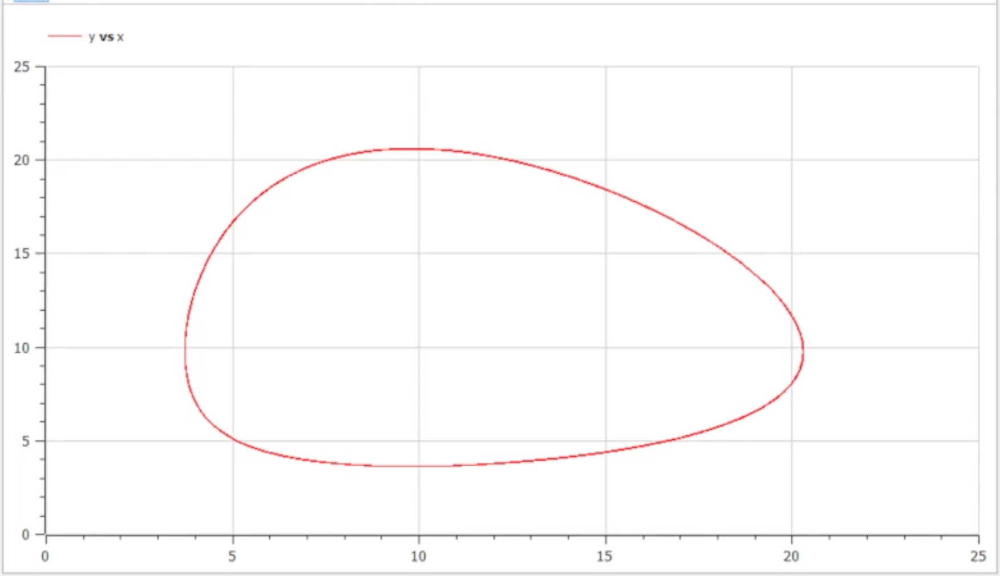
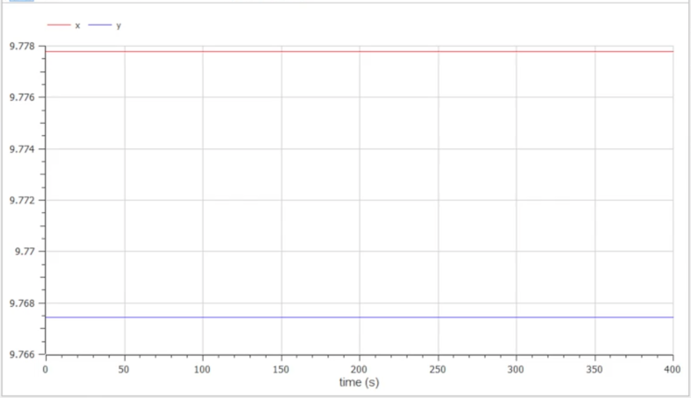

---
# Front matter
title: "Презентация о выполнении лабораторной работы №5"
subtitle: "Построение модели хищник-жертва"
author: "Евсеева Дарья Олеговна"
group: "НФИбд-01-19"
institute: "Российский Университет Дружбы Народов, Москва, Россия"
teacher: "Дмитрий Сергеевич Кулябов"
date: "11 марта, 2022"

# Generic options
lang: ru-RU
toc-title: "Содержание"

# Bibliography
bibliography: bib/cite.bib
csl: pandoc/csl/gost-r-7-0-5-2008-numeric.csl

# Pdf output format
toc: false # Table of contents
toc_depth: 2
fontsize: 12pt
linestretch: 1.5
papersize: a4
documentclass: scrreprt
## I18n
polyglossia-lang:
  name: russian
  options:
	- spelling=modern
	- babelshorthands=true
polyglossia-otherlangs:
  name: english
### Fonts
mainfont: PT Serif
romanfont: PT Serif
sansfont: PT Sans
monofont: PT Mono
mainfontoptions: Ligatures=TeX
romanfontoptions: Ligatures=TeX
sansfontoptions: Ligatures=TeX,Scale=MatchLowercase
monofontoptions: Scale=MatchLowercase,Scale=0.9
## Biblatex
biblatex: true
biblio-style: "gost-numeric"
biblatexoptions:
  - parentracker=true
  - backend=biber
  - hyperref=auto
  - language=auto
  - autolang=other*
  - citestyle=gost-numeric
## Misc options
indent: true
header-includes:
  - \linepenalty=10 # the penalty added to the badness of each line within a paragraph (no associated penalty node) Increasing the value makes tex try to have fewer lines in the paragraph.
  - \interlinepenalty=0 # value of the penalty (node) added after each line of a paragraph.
  - \hyphenpenalty=50 # the penalty for line breaking at an automatically inserted hyphen
  - \exhyphenpenalty=50 # the penalty for line breaking at an explicit hyphen
  - \binoppenalty=700 # the penalty for breaking a line at a binary operator
  - \relpenalty=500 # the penalty for breaking a line at a relation
  - \clubpenalty=150 # extra penalty for breaking after first line of a paragraph
  - \widowpenalty=150 # extra penalty for breaking before last line of a paragraph
  - \displaywidowpenalty=50 # extra penalty for breaking before last line before a display math
  - \brokenpenalty=100 # extra penalty for page breaking after a hyphenated line
  - \predisplaypenalty=10000 # penalty for breaking before a display
  - \postdisplaypenalty=0 # penalty for breaking after a display
  - \floatingpenalty = 20000 # penalty for splitting an insertion (can only be split footnote in standard LaTeX)
  - \raggedbottom # or \flushbottom
  - \usepackage{float} # keep figures where there are in the text
  - \floatplacement{figure}{H} # keep figures where there are in the text
---

# Прагматика выполнения

Задачи математического моделирования являются широко распространенными, и навыки их решения могут быть очень полезны в нашей будущей профессии. Также, среда OpenModelica является одним из самых подходящих по функциональным возможностям средств для решения подобных задач, и опыт работы в ней также будет полезен.

# Цель работы

Целью данной работы является построение модели "хищник-жертва" в среде OpenModelica.

# Задачи выполнения

Вариант №21.

Дана модель "хищник-жертва":

$$\left\{ \begin{aligned}{} \frac{dx}{dt} = - 0.42x(t) + 0.043x(t)y(t) \\ \frac{dy}{dt} = 0.44y(t) - 0.045x(t)y(t) \end{aligned} \right.$$

В ходе лабораторной работы для данной модели было необходимо:

1. Построить график зависимости численности хищников от численности жертвы, а также графики изменения численности хищников и численности жертв при следующих начальных условиях: $x_0 = 4$, $y_0 = 13$.
2. Найти стационарное состояние системы.

# Результаты выполнения

В ходе работы мы выполнили все поставленные задачи, а именно:

- Построили график изменения численности хищников и численности жертв

{ #fig:001 width=70% }

- Построили график зависимости численности хищников от численности жертвы

{ #fig:002 width=70% }

- Нашли стационарное состояние и построили для него соответствующие графики

{ #fig:003 width=70% }

{ #fig:004 width=70% }

# Выводы

В результате проделанной работы мы научились строить модели типа "хищник-жертва" в среде OpenModelica.
