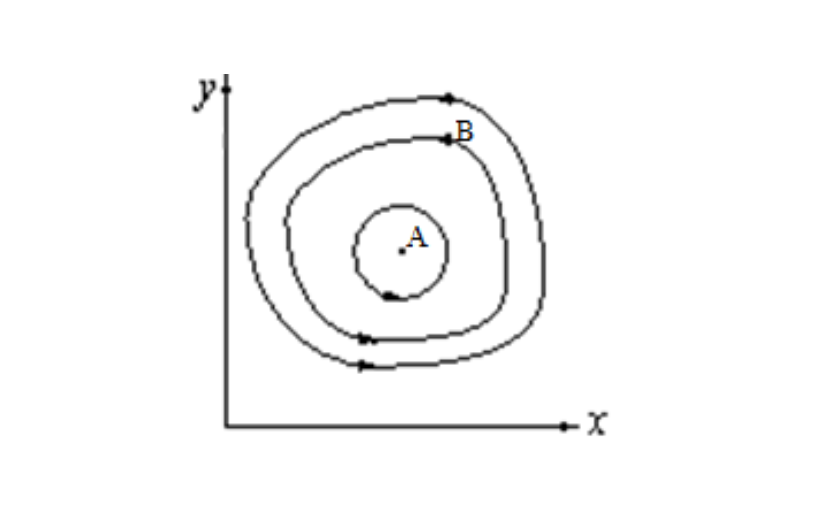
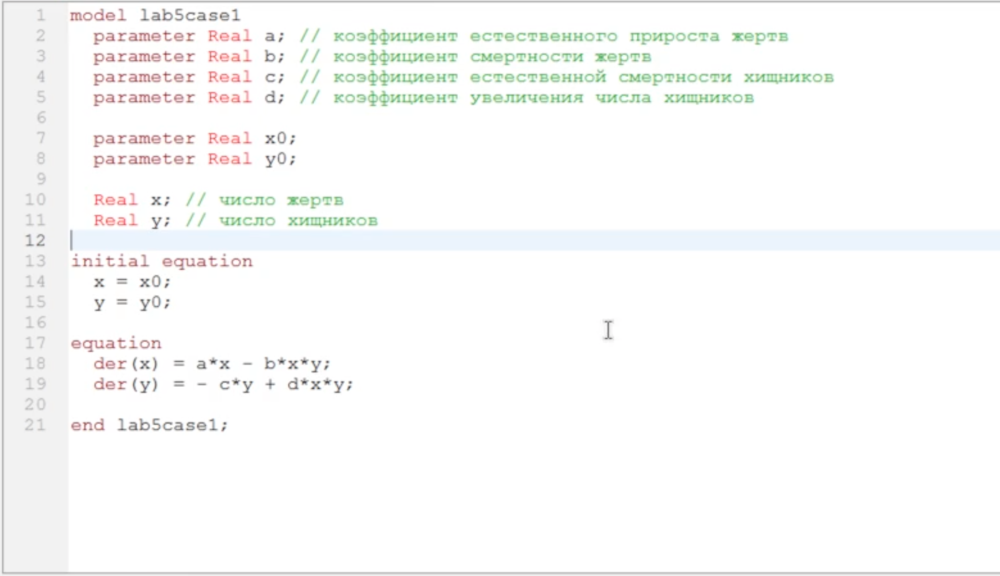
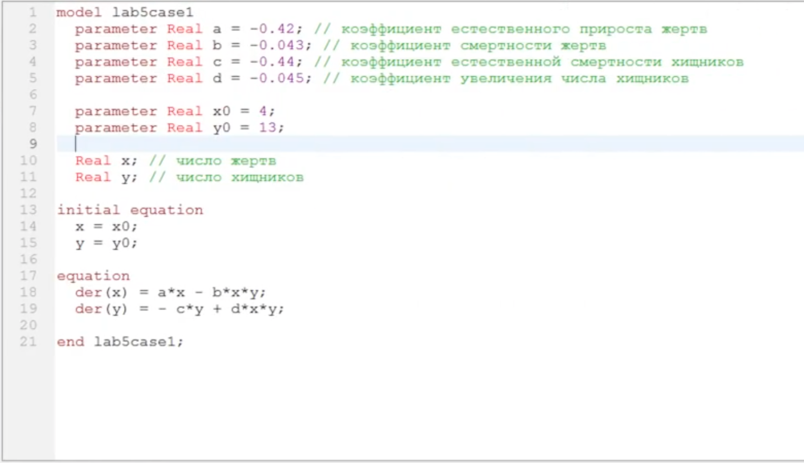
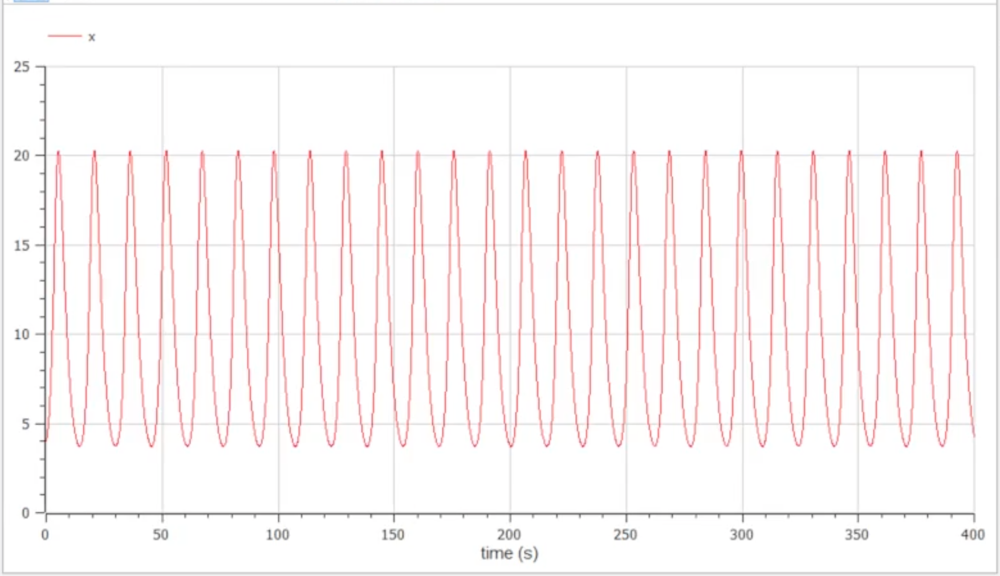
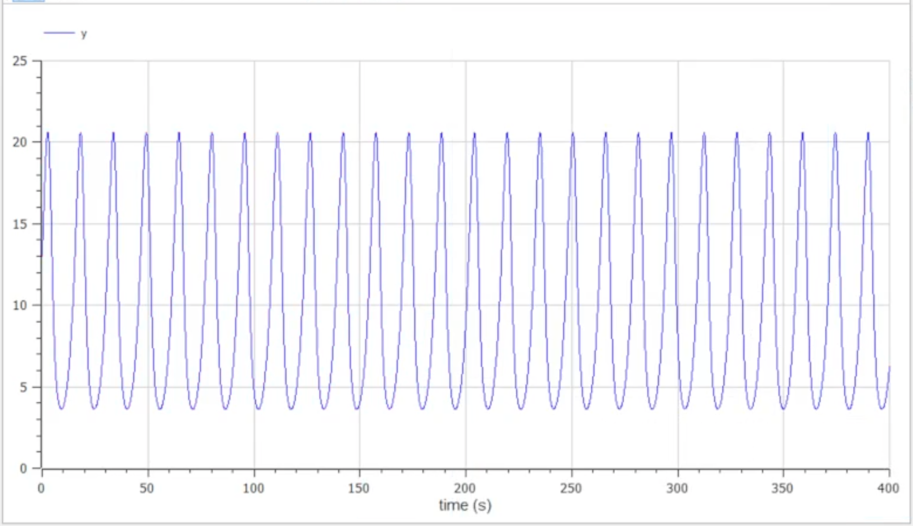
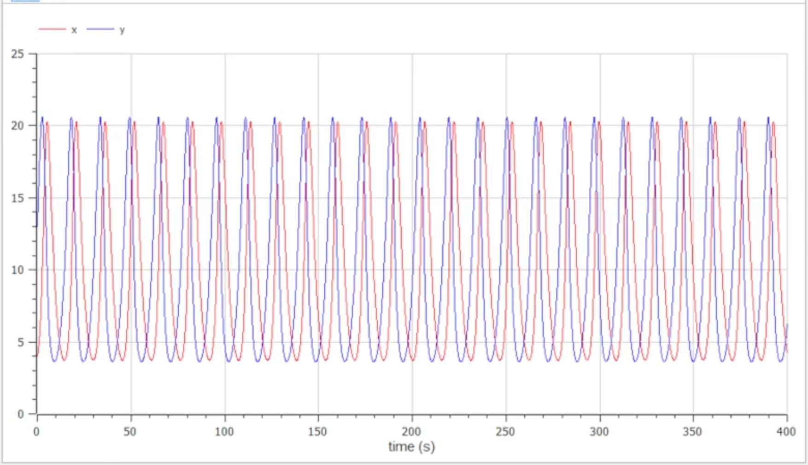
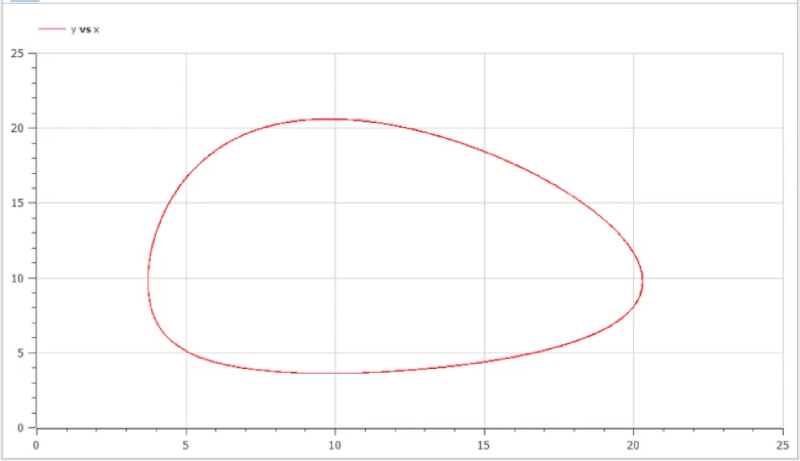
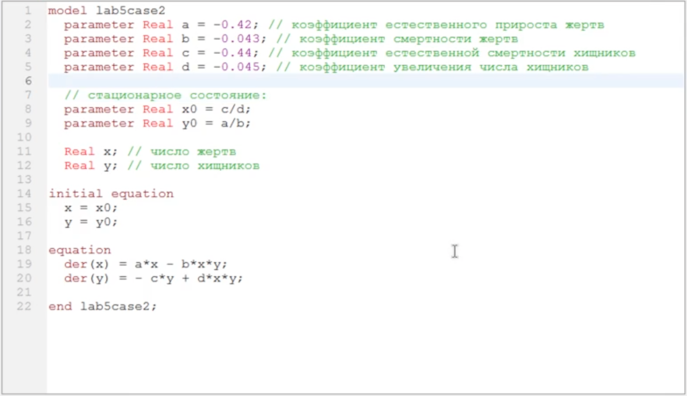
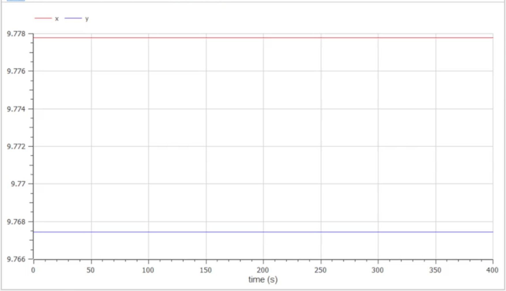
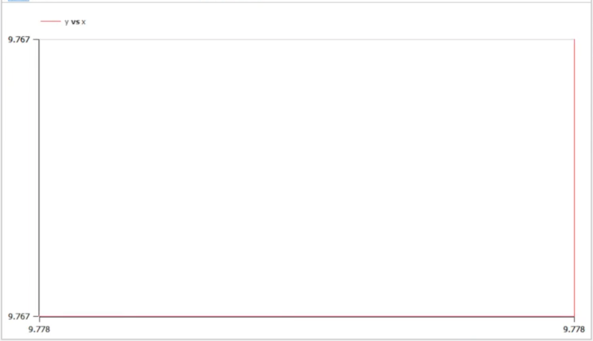

---
# Front matter
title: "Отчет по лабораторной работе №5"
subtitle: "Построение модели хищник-жертва"
author: "Евсеева Дарья Олеговна"
group: "НФИбд-01-19"
institute: "Российский Университет Дружбы Народов, Москва, Россия"
teacher: "Дмитрий Сергеевич Кулябов"
date: "10 марта, 2022"

# Generic options
lang: ru-RU
toc-title: "Содержание"

# Bibliography
bibliography: bib/cite.bib
csl: pandoc/csl/gost-r-7-0-5-2008-numeric.csl

# Pdf output format
toc: true # Table of contents
toc_depth: 2
lof: true # List of figures
lot: true # List of tables
fontsize: 12pt
linestretch: 1.5
papersize: a4
documentclass: scrreprt
## I18n
polyglossia-lang:
  name: russian
  options:
	- spelling=modern
	- babelshorthands=true
polyglossia-otherlangs:
  name: english
### Fonts
mainfont: PT Serif
romanfont: PT Serif
sansfont: PT Sans
monofont: PT Mono
mainfontoptions: Ligatures=TeX
romanfontoptions: Ligatures=TeX
sansfontoptions: Ligatures=TeX,Scale=MatchLowercase
monofontoptions: Scale=MatchLowercase,Scale=0.9
## Biblatex
biblatex: true
biblio-style: "gost-numeric"
biblatexoptions:
  - parentracker=true
  - backend=biber
  - hyperref=auto
  - language=auto
  - autolang=other*
  - citestyle=gost-numeric
## Misc options
indent: true
header-includes:
  - \linepenalty=10 # the penalty added to the badness of each line within a paragraph (no associated penalty node) Increasing the value makes tex try to have fewer lines in the paragraph.
  - \interlinepenalty=0 # value of the penalty (node) added after each line of a paragraph.
  - \hyphenpenalty=50 # the penalty for line breaking at an automatically inserted hyphen
  - \exhyphenpenalty=50 # the penalty for line breaking at an explicit hyphen
  - \binoppenalty=700 # the penalty for breaking a line at a binary operator
  - \relpenalty=500 # the penalty for breaking a line at a relation
  - \clubpenalty=150 # extra penalty for breaking after first line of a paragraph
  - \widowpenalty=150 # extra penalty for breaking before last line of a paragraph
  - \displaywidowpenalty=50 # extra penalty for breaking before last line before a display math
  - \brokenpenalty=100 # extra penalty for page breaking after a hyphenated line
  - \predisplaypenalty=10000 # penalty for breaking before a display
  - \postdisplaypenalty=0 # penalty for breaking after a display
  - \floatingpenalty = 20000 # penalty for splitting an insertion (can only be split footnote in standard LaTeX)
  - \raggedbottom # or \flushbottom
  - \usepackage{float} # keep figures where there are in the text
  - \floatplacement{figure}{H} # keep figures where there are in the text
---

# Цель работы

Целью данной работы является построение модели "хищник-жертва" в среде OpenModelica.

# Задание

Вариант №21.

Для модели "хищник-жертва":

$$\left\{ \begin{aligned}{} \frac{dx}{dt} = - 0.42x(t) + 0.043x(t)y(t) \\ \frac{dy}{dt} = 0.44y(t) - 0.045x(t)y(t) \end{aligned} \right.$$

1. Постройте график зависимости численности хищников от численности жертвы, а также графики изменения численности хищников и численности жертв при следующих начальных условиях: $x_0 = 4$, $y_0 = 13$.
2. Найдите стационарное состояние системы.

# Теоретическое введение

OpenModelica --- свободное открытое программное обеспечение для моделирования, симуляции, оптимизации и анализа сложных динамических систем. Основано на языке Modelica.

Простейшая модель взаимодействия двух видов типа "хищник-жертва" --- модель Лотки-Вольтерры. Данная двувидовая модель основывается на следующих предположениях:

1. Численность популяции жертв $x$ и хищников $y$ зависят только от времени (модель не учитывает пространственное распределение популяции на занимаемой территории)
2. В отсутствии взаимодействия численность видов изменяется по модели Мальтуса, при этом число жертв увеличивается, а число хищников падает
3. Естественная смертность жертвы и естественная рождаемость хищника считаются несущественными
4. Эффект насыщения численности обеих популяций не учитывается
5. Скорость роста численности жертв уменьшается пропорционально численности хищников

$\left\{ \begin{aligned}{} \frac{dx}{dt} = ax(t) - bx(t)y(t) \\ \frac{dy}{dt} = cy(t) + dx(t)y(t) \end{aligned} \right.$ (1)

В этой модели $x$ --- число жертв, $y$ --- число хищников. Коэффициент $a$ описывает скорость естественного прироста числа жертв в отсутствие хищников, $c$ --- естественное вымирание хищников, лишенных пищи в виде жертв. Вероятность взаимодействия жертвы и хищника считается пропорциональной как количеству жертв, так и числу самих хищников ($xy$). Каждый аки взаимодействия уменьшает популяцию жертв, но способствует увеличению популяции хищников (члены $-bxy$ и $dxy$ в правой части уравнения).

{ #fig:001 width=70% }

Математический анализ этой (жесткой) модели показывает, что имеется стационарное состояние ($A$ на рисунке выше), всякое же другое начальное состояние ($B$) приводит к периодическому колебанию численности как жертв, так и хищников, так что по прошествии некоторого времени система возвращается в состояние $B$.

Стационарное состояние системы (1) (положение равновесия , не зависящее от времени решение) будет в точке: $x_0 = \frac{c}{d}$, $y_0 = \frac{a}{b}$. Если начальные значения задать в стационарном состоянии $x(0) = x_0$, $y(0) = y_0$, то в любой момент времени численность популяций изменяться не будет. При малом отклонении от положения равновесия численности как хищника, так и жертвы с течение времени возвращаются к равновесным значениям, а совершают периодические колебания вокруг стационарной точки. Амплитуда колебаний и их период определяется начальными значениями численностей $x(0)$, $y(0)$. Колебания совершаются в противофазе.

# Выполнение лабораторной работы

## 1. Написание заготовки для построения моделей

Напишем основу программы для построения требуемых моделей. Работу будем выполнять в среде OpenModelica.

Определим необходимые переменные и параметры и запишем исходные уравнения.

{ #fig:002 width=70% }

## 2. Построение модели "хищник-жертва"

Дополним код заготовки программы в соответствии с данными задачи для того, чтобы построить модель "хищник-жертва".

Зададим значения для параметров и начальных данных.

{ #fig:003 width=70% }

Запустим симуляцию и отобразим на графиках значения переменных $x$ и $y$, то есть изменение численности жертв и хищников соответственно.

{ #fig:004 width=70% }

{ #fig:005 width=70% }

{ #fig:006 width=70% }

Также откроем параметрическое отображение графика, чтобы увидеть зависимость численности хищников от численности жертв.

{ #fig:007 width=70% }

## 3. Нахождение стационарного состояния

Теперь для нахождения стационарного состояния системы подставим в начальные данные соответствующие формулы вместо значений, заданных в условиях задачи.

{ #fig:008 width=70% }

Запустим симуляцию и отобразим на графике значения переменных $x$ и $y$, то есть изменение численности жертв и хищников соответственно.

{ #fig:009 width=70% }

Как можно видеть из полученного графика, значения со временем остаются на одном уровне, соответственно данное состояние действительно является стационарным.

Также откроем параметрическое отображение графика.

{ #fig:010 width=70% }

# Выводы

В результате проделанной работы мы научились строить модели типа "хищник-жертва" в среде OpenModelica.

# Список литературы{.unnumbered}

- Методические материалы к лабораторной работе, представленные на сайте "ТУИС РУДН" https://esystem.rudn.ru/
- Документация OpenModelica https://www.openmodelica.org/doc/OpenModelicaUsersGuide/latest/

::: {#refs}
:::
