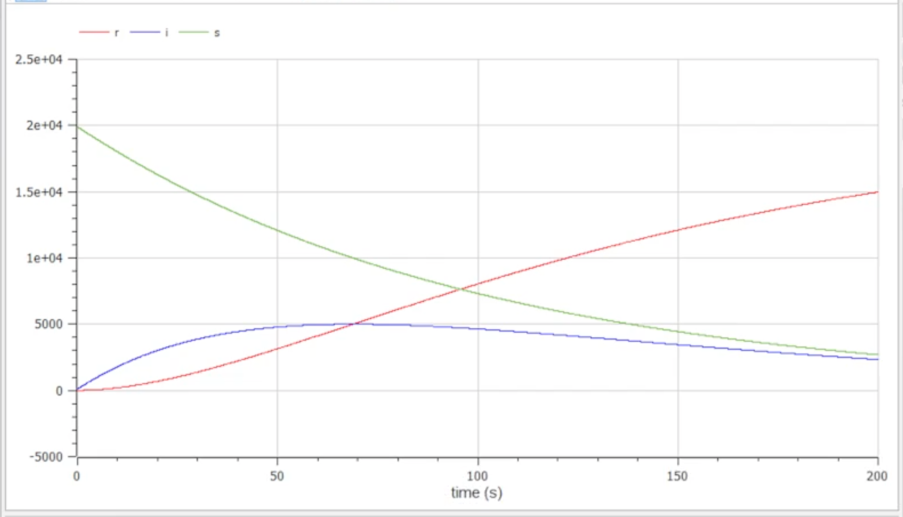

---
# Front matter
title: "Презентация о выполнении лабораторной работы №6"
subtitle: "Построение модели эпидемии"
author: "Евсеева Дарья Олеговна"
group: "НФИбд-01-19"
institute: "Российский Университет Дружбы Народов, Москва, Россия"
teacher: "Дмитрий Сергеевич Кулябов"
date: "16 марта, 2022"

# Formatting
lang: ru-RU
toc: false
slide_level: 2
theme: metropolis
header-includes:
 - \metroset{sectionpage=none,numbering=fraction}
 - '\makeatletter'
 - '\beamer@ignorenonframefalse'
 - '\makeatother'
aspectratio: 43
section-titles: true
---

# Прагматика выполнения

Задачи математического моделирования являются широко распространенными, и навыки их решения могут быть очень полезны в нашей будущей профессии. Также, среда OpenModelica является одним из самых подходящих по функциональным возможностям средств для решения подобных задач, и опыт работы в ней также будет полезен.

# Цель работы

Целью данной работы является построение модели эпидемии в среде OpenModelica.

# Задачи выполнения

Даны условия задачи (вариант №21):

На одном острове вспыхнула эпидемия. Известно, что из всех проживающих на острове ($N = 20000$) в момент начала эпидемии ($t = 0$) число заболевших людей (являющихся распространителями инфекции) $I(0) = 99$, а число здоровых людей с иммунитетом к болезни $R(0) = 5$. Таким образом, число людей, восприимчивых к болезни, но пока здоровых, в начальный момент времени $S(0) = N - I(0) - R(0)$.

## Задачи выполнения

В ходе лабораторной работы было необходимо построить графики изменения числа особей в каждой из трех групп для двух случаев:

1. если $I(0) \leq I^*$
2. если $I(0) > I^*$

# Результаты выполнения

- Построили график модели для случая $I(0) \leq I^*$

{ #fig:001 width=70% }

## Результаты выполнения

- Построили график модели для случая $I(0) > I^*$

{ #fig:002 width=70% }

# Выводы

В результате проделанной работы мы научились строить модели эпидемии в среде OpenModelica.
