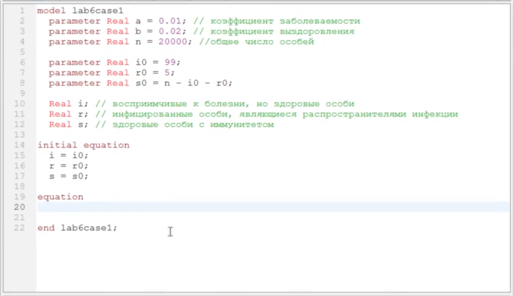
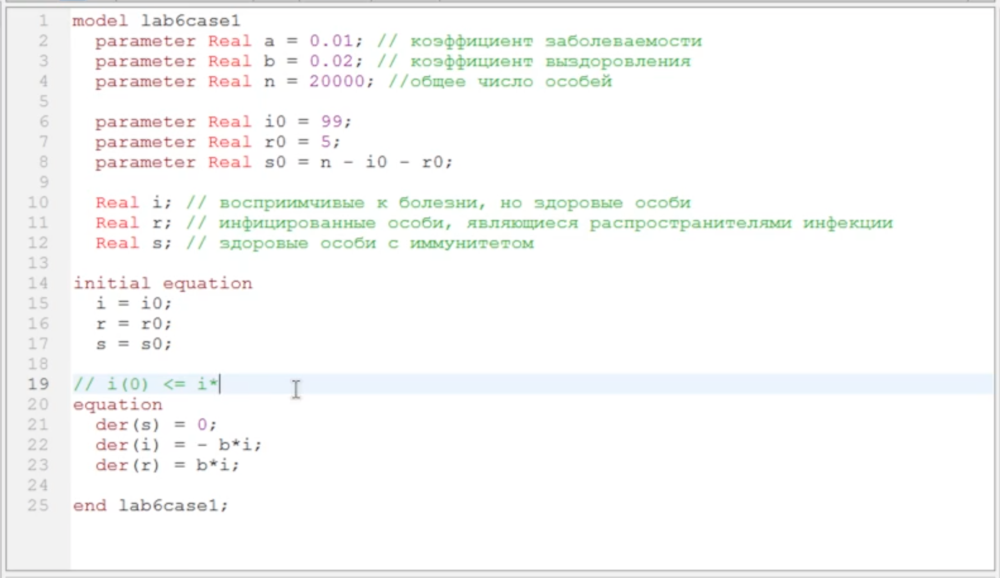
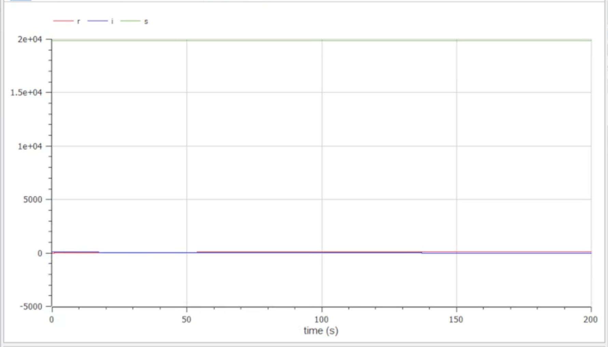
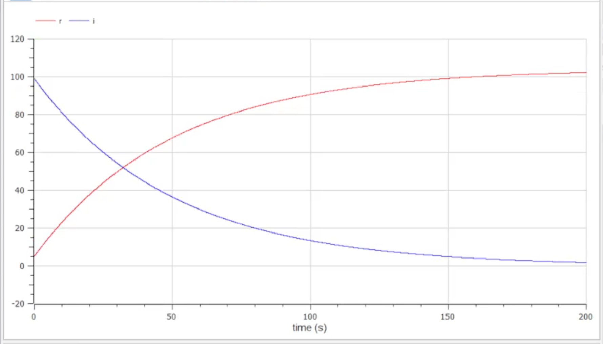
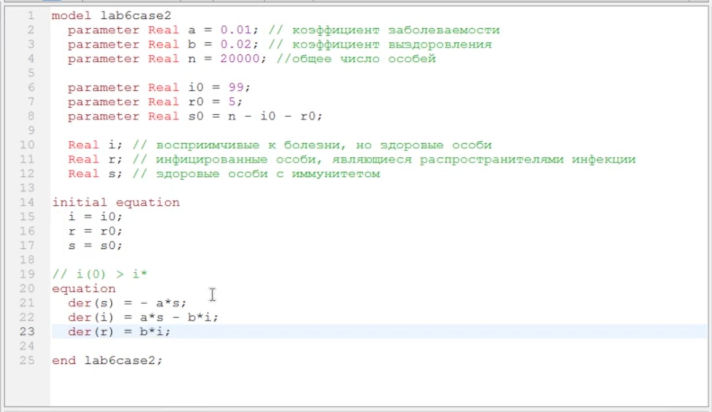
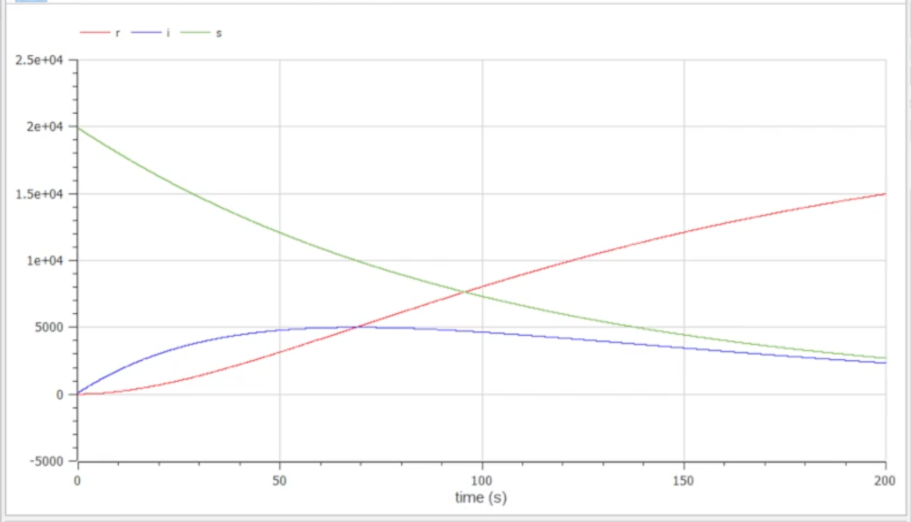

---
# Front matter
title: "Отчет по лабораторной работе №6"
subtitle: "Построение модели эпидемии"
author: "Евсеева Дарья Олеговна"
group: "НФИбд-01-19"
institute: "Российский Университет Дружбы Народов, Москва, Россия"
teacher: "Дмитрий Сергеевич Кулябов"
date: "16 марта, 2022"

# Generic options
lang: ru-RU
toc-title: "Содержание"

# Bibliography
bibliography: bib/cite.bib
csl: pandoc/csl/gost-r-7-0-5-2008-numeric.csl

# Pdf output format
toc: true # Table of contents
toc_depth: 2
lof: true # List of figures
lot: false # List of tables
fontsize: 12pt
linestretch: 1.5
papersize: a4
documentclass: scrreprt
## I18n
polyglossia-lang:
  name: russian
  options:
	- spelling=modern
	- babelshorthands=true
polyglossia-otherlangs:
  name: english
### Fonts
mainfont: PT Serif
romanfont: PT Serif
sansfont: PT Sans
monofont: PT Mono
mainfontoptions: Ligatures=TeX
romanfontoptions: Ligatures=TeX
sansfontoptions: Ligatures=TeX,Scale=MatchLowercase
monofontoptions: Scale=MatchLowercase,Scale=0.9
## Biblatex
biblatex: true
biblio-style: "gost-numeric"
biblatexoptions:
  - parentracker=true
  - backend=biber
  - hyperref=auto
  - language=auto
  - autolang=other*
  - citestyle=gost-numeric
## Misc options
indent: true
header-includes:
  - \linepenalty=10 # the penalty added to the badness of each line within a paragraph (no associated penalty node) Increasing the value makes tex try to have fewer lines in the paragraph.
  - \interlinepenalty=0 # value of the penalty (node) added after each line of a paragraph.
  - \hyphenpenalty=50 # the penalty for line breaking at an automatically inserted hyphen
  - \exhyphenpenalty=50 # the penalty for line breaking at an explicit hyphen
  - \binoppenalty=700 # the penalty for breaking a line at a binary operator
  - \relpenalty=500 # the penalty for breaking a line at a relation
  - \clubpenalty=150 # extra penalty for breaking after first line of a paragraph
  - \widowpenalty=150 # extra penalty for breaking before last line of a paragraph
  - \displaywidowpenalty=50 # extra penalty for breaking before last line before a display math
  - \brokenpenalty=100 # extra penalty for page breaking after a hyphenated line
  - \predisplaypenalty=10000 # penalty for breaking before a display
  - \postdisplaypenalty=0 # penalty for breaking after a display
  - \floatingpenalty = 20000 # penalty for splitting an insertion (can only be split footnote in standard LaTeX)
  - \raggedbottom # or \flushbottom
  - \usepackage{float} # keep figures where there are in the text
  - \floatplacement{figure}{H} # keep figures where there are in the text
---

# Цель работы

Целью данной работы является построение модели эпидемии в среде OpenModelica.

# Задание

Вариант №21.

На одном острове вспыхнула эпидемия. Известно, что из всех проживающих на острове ($N = 20000$) в момент начала эпидемии ($t = 0$) число заболевших людей (являющихся распространителями инфекции) $I(0) = 99$, а число здоровых людей с иммунитетом к болезни $R(0) = 5$. Таким образом, число людей, восприимчивых к болезни, но пока здоровых, в начальный момент времени $S(0) = N - I(0) - R(0)$.

Необходимо построить графики изменения числа особей в каждой из трех групп для следующих случаев:

1. если $I(0) \leq I^*$
2. если $I(0) > I^*$

# Теоретическое введение

OpenModelica --- свободное открытое программное обеспечение для моделирования, симуляции, оптимизации и анализа сложных динамических систем. Основано на языке Modelica.

Рассмотрим простейшую модель эпидемии. Предположим, что некая популяция, состоящая из $N$ особей, (считаем, что популяция изолирована) подразделяется на три группы. Первая группа --- это восприимчивые к болезни, но пока здоровые особи, обозначим их через $S(t)$. Вторая группа --- это число инфицированных особей, которые также при этом являются распространителями инфекции, обозначим их $I(t)$. А третья группа, обозначающая через $R(t)$ --- это здоровые особи с иммунитетом к болезни.

До того, как число заболевших не превышает критического значения $I^*$, считаем, что все больные изолированы и не заражают здоровых. Когда $I(t) > I^*$, тогда инфицированные способны заражать восприимчивых к болезни особей.

Таким образом, скорость изменения числа $S(t)$ меняется по следующему закону:

$$\frac{dS}{dt} = {\left\{ \begin{aligned}{} - \alpha S, \text{ если } I(t) > I^* \\ 0, \text{ если } I(t) \leq I^* \end{aligned} \right.}$$

Поскольку каждая восприимчивая к болезни особь, которая, в конце концов, заболевает, сама становится инфекционной, то скорость изменения числа инфекционных особей представляет разность за единицу времени между заразившимися и теми, кто уже болеет и лечится, т.е.:

$$\frac{dI}{dt} = {\left\{ \begin{aligned}{} \alpha S - \beta I, \text{ если } I(t) > I^* \\ - \beta I, \text{ если } I(t) \leq I^* \end{aligned} \right.}$$

А скорость изменения выздоравливающих особей (при этом приобретающих иммунитет к болезни):

$$\frac{dR}{dt} = \beta I$$

Постоянные пропорциональности $\alpha$, $\beta$ --- это коэффициенты заболеваемости и выздоровления соответственно.

# Выполнение лабораторной работы

## 1. Написание заготовки для построения моделей

Напишем основу программы для построения требуемых моделей. Работу будем выполнять в среде OpenModelica.

Определим необходимые переменные и параметры. Зададим для параметров значения (коэффициенты $\alpha$ и $\beta$ зададим самостоятельно).

{ #fig:001 width=70% }

## 2. Построение модели для первого случая

Дополним код заготовки программы в соответствии с условиями задачи, чтобы построить модель для первого случая.

Запишем уравнения для случая, когда $I(0) \leq I^*$.

{ #fig:002 width=70% }

Запустим симуляцию и отобразим на графике значения переменных $R$, $I$ и $S$.

{ #fig:003 width=70% }

Также отобразим на графике отдельно $R$ и $I$, чтобы лучше рассмотреть их поведение.

{ #fig:004 width=70% }

## 3. Построение модели для второго случая

Теперь дополним код заготовки программы в соответствии с условиями задачи, чтобы построить модель для второго случая.

Запишем уравнения для случая, когда $I(0) > I^*$.

{ #fig:005 width=70% }

Запустим симуляцию и отобразим на графике значения переменных $R$, $I$ и $S$.

{ #fig:006 width=70% }

# Выводы

В результате проделанной работы мы научились строить модели эпидемии в среде OpenModelica.

# Список литературы{.unnumbered}

- Методические материалы к лабораторной работе, представленные на сайте "ТУИС РУДН" https://esystem.rudn.ru/
- Документация OpenModelica https://www.openmodelica.org/doc/OpenModelicaUsersGuide/latest/

::: {#refs}
:::
