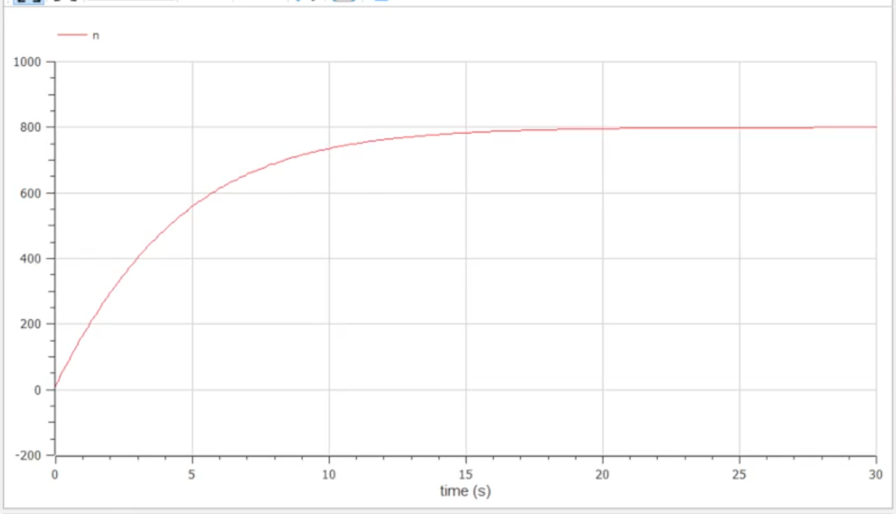
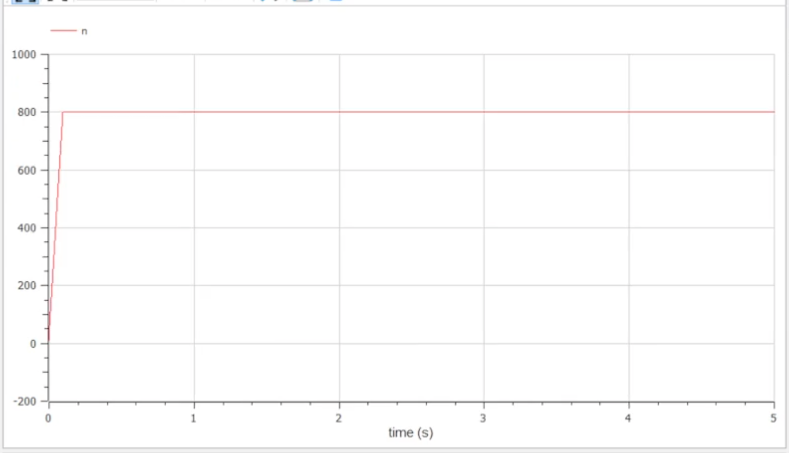
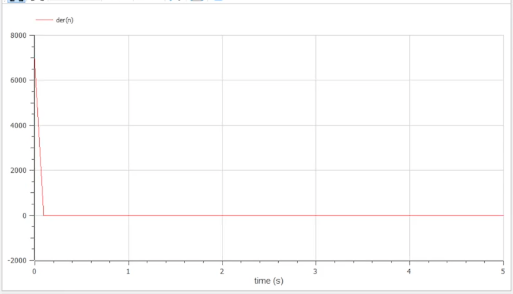
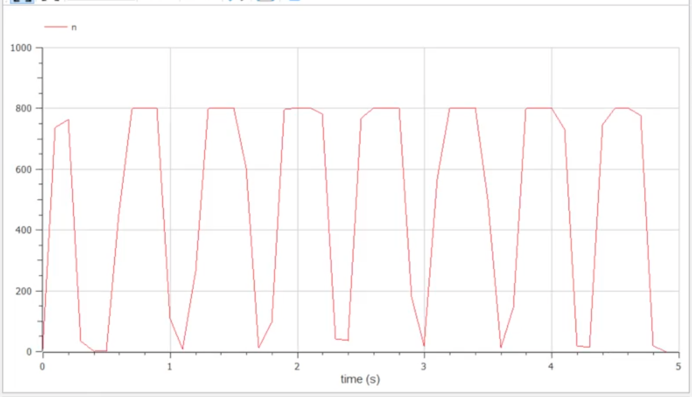

---
# Front matter
title: "Презентация о выполнении лабораторной работы №7"
subtitle: "Построение модели распространения рекламы"
author: "Евсеева Дарья Олеговна"
group: "НФИбд-01-19"
institute: "Российский Университет Дружбы Народов, Москва, Россия"
teacher: "Дмитрий Сергеевич Кулябов"
date: "24 марта, 2022"

# Formatting
lang: ru-RU
toc: false
slide_level: 2
theme: metropolis
header-includes:
 - \metroset{sectionpage=none,numbering=fraction}
 - '\makeatletter'
 - '\beamer@ignorenonframefalse'
 - '\makeatother'
aspectratio: 43
section-titles: true
---

# Прагматика выполнения

Задачи математического моделирования являются широко распространенными, и навыки их решения могут быть очень полезны в нашей будущей профессии. Также, среда OpenModelica является одним из самых подходящих по функциональным возможностям средств для решения подобных задач, и опыт работы в ней также будет полезен.

# Цель работы

Целью данной работы является построение модели распространения рекламы в среде OpenModelica.

# Задачи выполнения

Вариант №21.

Необходимо построить график распространения рекламы, математическая модель которой описывается следующим уравнением:

1. $\frac{dn}{dt} = (0.21 + 0.00008n(t))(N - n(t))$
2. $\frac{dn}{dt} = (0.000012 + 0.8n(t))(N - n(t))$
3. $\frac{dn}{dt} = (0.1 sin(t) + 0.1 cos(10t) n(t))(N - n(t))$

## Задачи выполнения

При этом объем аудитории $N = 800$, в начальный момент о товаре знает 11 человек. Для случая 2 необходимо определить, в какой момент времени скорость распространения рекламы будет иметь максимальное значение.

# Результаты выполнения

- Построили график модели для первого случая

{ #fig:001 width=70% }

## Результаты выполнения

- Построили график модели для второго случая

{ #fig:002 width=70% }

## Результаты выполнения

Также построили график скорости распространения рекламы

{ #fig:003 width=70% }

## Результаты выполнения

- Построили график модели для третьего случая

{ #fig:004 width=70% }

# Выводы

В результате проделанной работы мы научились строить модели распространения рекламы в среде OpenModelica.
