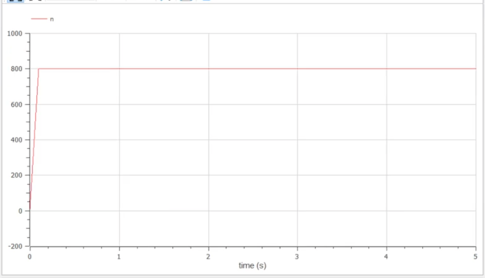
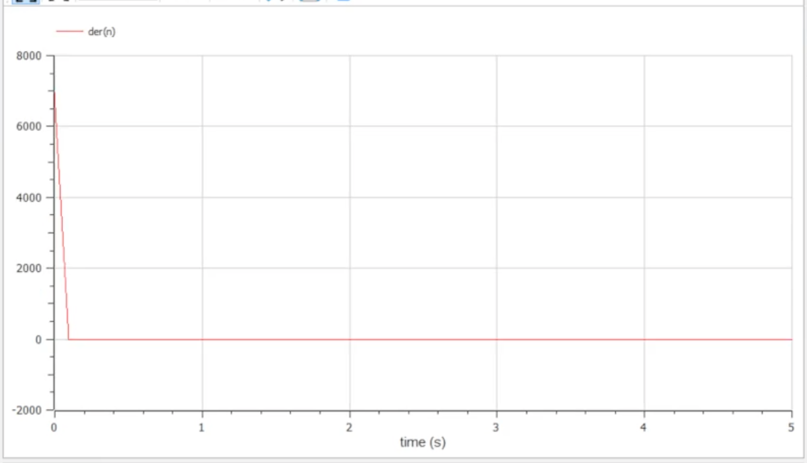

---
# Front matter
title: "Отчет по лабораторной работе №7"
subtitle: "Построение модели распространения рекламы"
author: "Евсеева Дарья Олеговна"
group: "НФИбд-01-19"
institute: "Российский Университет Дружбы Народов, Москва, Россия"
teacher: "Дмитрий Сергеевич Кулябов"
date: "24 марта, 2022"

# Generic options
lang: ru-RU
toc-title: "Содержание"

# Bibliography
bibliography: bib/cite.bib
csl: pandoc/csl/gost-r-7-0-5-2008-numeric.csl

# Pdf output format
toc: true # Table of contents
toc_depth: 2
lof: true # List of figures
lot: false # List of tables
fontsize: 12pt
linestretch: 1.5
papersize: a4
documentclass: scrreprt
## I18n
polyglossia-lang:
  name: russian
  options:
	- spelling=modern
	- babelshorthands=true
polyglossia-otherlangs:
  name: english
### Fonts
mainfont: PT Serif
romanfont: PT Serif
sansfont: PT Sans
monofont: PT Mono
mainfontoptions: Ligatures=TeX
romanfontoptions: Ligatures=TeX
sansfontoptions: Ligatures=TeX,Scale=MatchLowercase
monofontoptions: Scale=MatchLowercase,Scale=0.9
## Biblatex
biblatex: true
biblio-style: "gost-numeric"
biblatexoptions:
  - parentracker=true
  - backend=biber
  - hyperref=auto
  - language=auto
  - autolang=other*
  - citestyle=gost-numeric
## Misc options
indent: true
header-includes:
  - \linepenalty=10 # the penalty added to the badness of each line within a paragraph (no associated penalty node) Increasing the value makes tex try to have fewer lines in the paragraph.
  - \interlinepenalty=0 # value of the penalty (node) added after each line of a paragraph.
  - \hyphenpenalty=50 # the penalty for line breaking at an automatically inserted hyphen
  - \exhyphenpenalty=50 # the penalty for line breaking at an explicit hyphen
  - \binoppenalty=700 # the penalty for breaking a line at a binary operator
  - \relpenalty=500 # the penalty for breaking a line at a relation
  - \clubpenalty=150 # extra penalty for breaking after first line of a paragraph
  - \widowpenalty=150 # extra penalty for breaking before last line of a paragraph
  - \displaywidowpenalty=50 # extra penalty for breaking before last line before a display math
  - \brokenpenalty=100 # extra penalty for page breaking after a hyphenated line
  - \predisplaypenalty=10000 # penalty for breaking before a display
  - \postdisplaypenalty=0 # penalty for breaking after a display
  - \floatingpenalty = 20000 # penalty for splitting an insertion (can only be split footnote in standard LaTeX)
  - \raggedbottom # or \flushbottom
  - \usepackage{float} # keep figures where there are in the text
  - \floatplacement{figure}{H} # keep figures where there are in the text
---

# Цель работы

Целью данной работы является построение модели распространения рекламы в среде OpenModelica.

# Задание

Вариант №21.

Необходимо построить график распространения рекламы, математическая модель которой описывается следующим уравнением:

1. $\frac{dn}{dt} = (0.21 + 0.00008n(t))(N - n(t))$
2. $\frac{dn}{dt} = (0.000012 + 0.8n(t))(N - n(t))$
3. $\frac{dn}{dt} = (0.1 sin(t) + 0.1 cos(10t) n(t))(N - n(t))$

При этом объем аудитории $N = 800$, в начальный момент о товаре знает 11 человек. Для случая 2 необходимо определить, в какой момент времени скорость распространения рекламы будет иметь максимальное значение.

# Теоретическое введение

OpenModelica --- свободное открытое программное обеспечение для моделирования, симуляции, оптимизации и анализа сложных динамических систем. Основано на языке Modelica.

Модель рекламной кампании описывается следующими величинами. Считаем, что $\frac{dn}{dt}$ --- скорость изменения со временем числа потребителей, узнавших о товаре и готовых его купить, $t$ --- время, прошедшее с начала рекламной кампании, $n(t)$ --- число уже информированных клиентов. Эта величина пропорциональна числу покупателей, еще не знающих о нем, это описывается следующим образом: $\alpha_1(t)(N - n(t))$, где $N$ --- общее число потенциальных платежеспособных покупателей, $\alpha_1(t) > 0$ --- характеризует интенсивность рекламной кампании (зависит от затрат на рекламу в данный момент времени). Помимо этого, узнавшие о товаре потребители также распространяют полученную информацию среди потенциальных покупателей, не знающих о нем (в этом случае работает т.н. сарафанное радио). Этот вклад в рекламу описывается величиной $\alpha_2(t)(N - n(t))$, эта величина увеличивается с увеличением потребителей, узнавших о товаре.

Математическая модель распространения рекламы описывается уравнением: $$\frac{dn}{dt} = (\alpha_1(t) + \alpha_2(t)n(t))(N - n(t))$$

При $\alpha_1(t) >> \alpha_2(t)$ получается модель типа модели Мальтуса. В обратном случае, при $\alpha_2(t) >> \alpha_1(t)$ получается уравнение логистической кривой.

# Выполнение лабораторной работы

## 1. Написание заготовки для построения моделей

Напишем основу программы для построения требуемых моделей. Работу будем выполнять в среде OpenModelica.

Определим необходимые переменные и параметры и запишем уравнение.

{ #fig:001 width=70% }

## 2. Построение модели для первого случая

Дополним код заготовки программы, чтобы построить модель для первого случая.

{ #fig:002 width=70% }

Запустим симуляцию и отобразим на графике значение переменной $n$.

{ #fig:003 width=70% }

## 3. Построение модели для второго случая

Теперь дополним код заготовки программы, чтобы построить модель для второго случая.

{ #fig:004 width=70% }

Запустим симуляцию и отобразим на графике значение переменной $n$.

{ #fig:005 width=70% }

Также откроем график $\frac{dn}{dt}$, чтобы определить, в какой момент времени скорость распространения рекламы будет иметь максимальное значение.

{ #fig:006 width=70% }

Из графика мы видим, что максимальное значение достигается в начальный момент времени.

## 4. Построение модели для третьего случая

Теперь дополним код заготовки программы, чтобы построить модель для третьего случая.

{ #fig:007 width=70% }

Запустим симуляцию и отобразим на графике значение переменной $n$.

{ #fig:008 width=70% }

# Выводы

В результате проделанной работы мы научились строить модели распространения рекламы в среде OpenModelica.

# Список литературы{.unnumbered}

- Методические материалы к лабораторной работе, представленные на сайте "ТУИС РУДН" https://esystem.rudn.ru/
- Документация OpenModelica https://www.openmodelica.org/doc/OpenModelicaUsersGuide/latest/

::: {#refs}
:::
