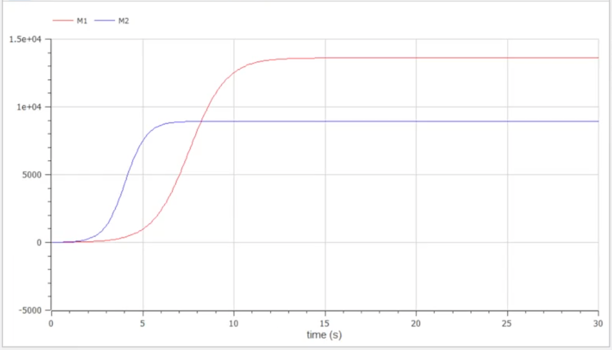

---
# Front matter
title: "Презентация о выполнении лабораторной работы №8"
subtitle: "Построение модели конкуренции двух фирм"
author: "Евсеева Дарья Олеговна"
group: "НФИбд-01-19"
institute: "Российский Университет Дружбы Народов, Москва, Россия"
teacher: "Дмитрий Сергеевич Кулябов"
date: "1 апреля, 2022"

# Formatting
lang: ru-RU
toc: false
slide_level: 2
theme: metropolis
header-includes:
 - \metroset{sectionpage=none,numbering=fraction}
 - '\makeatletter'
 - '\beamer@ignorenonframefalse'
 - '\makeatother'
aspectratio: 43
section-titles: true
---

# Прагматика выполнения

Задачи математического моделирования являются широко распространенными, и навыки их решения могут быть очень полезны в нашей будущей профессии. Также, среда OpenModelica является одним из самых подходящих по функциональным возможностям средств для решения подобных задач, и опыт работы в ней также будет полезен.

# Цель работы

Целью данной работы является построение модели конкуренции двух фирм в среде OpenModelica.

# Задачи выполнения

Вариант №21.

Необходимо построить графики изменения оборотных средств фирмы 1 и фирмы 2 без учета постоянных издержек и с введенной нормировкой для следующих случаев:

## Задачи выполнения

Случай 1:
$$\frac{dM_1}{d\theta} = M_1 - \frac{b}{c_1} M_1 M_2 - \frac{a_1}{c_1} M_1^2,$$
$$\frac{dM_2}{d\theta} = \frac{c_2}{c_1} M_2 - \frac{b}{c_1} M_1 M_2 - \frac{a_2}{c_1} M_2^2$$

## Задачи выполнения

Случай 2:

$$\frac{dM_1}{d\theta} = M_1 - (\frac{b}{c_1} + 0.00012) M_1 M_2 -\frac{a_1}{c_1} M_1^2,$$
$$\frac{dM_2}{d\theta} = \frac{c_2}{c_1} M_2 - \frac{b}{c_1} M_1 M_2 - \frac{a_2}{c_1} M_2^2$$

## Задачи выполнения

Для обоих случаев задача рассматривается со следующими начальными условиями и параметрами:

$M_0^1 = 7, M_0^2 = 8,$

$p_{cr} = 45, N = 70, q = 1,$

$\tau_1 = 25, \tau_2 = 20,$

$\tilde{p}_1 = 10, \tilde{p}_2 = 7.7$

# Результаты выполнения

- Построили график модели для первого случая

{ #fig:001 width=70% }

## Результаты выполнения

- Построили график модели для второго случая

{ #fig:002 width=70% }

# Выводы

В результате проделанной работы мы научились строить модели конкуренции двух фирм в среде OpenModelica.
