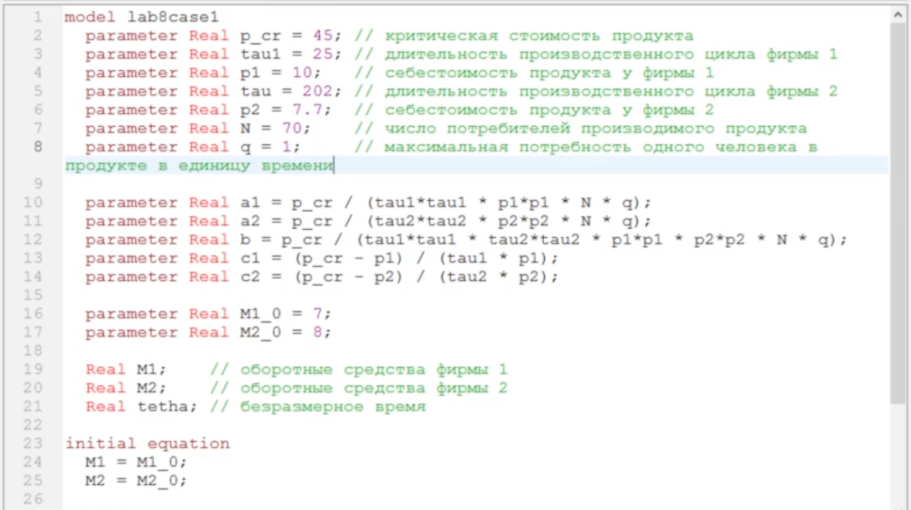
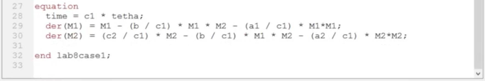
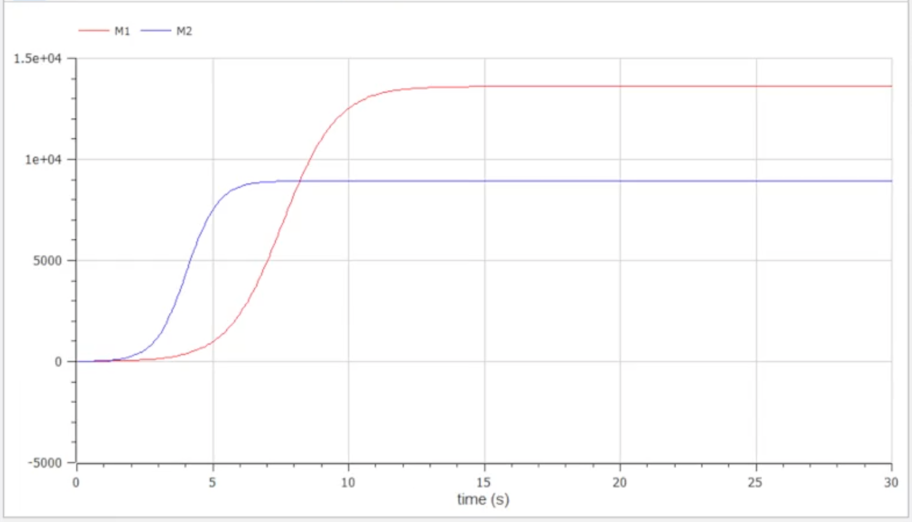
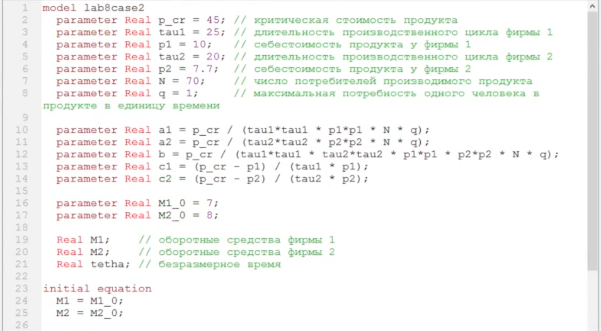
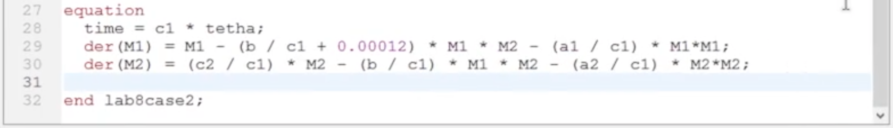
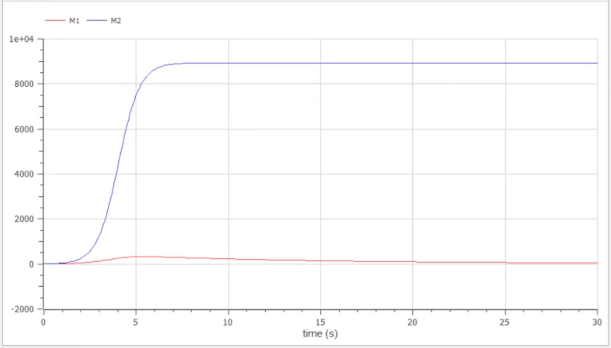

---
# Front matter
title: "Отчет по лабораторной работе №8"
subtitle: "Построение модели конкуренции двух фирм"
author: "Евсеева Дарья Олеговна"
group: "НФИбд-01-19"
institute: "Российский Университет Дружбы Народов, Москва, Россия"
teacher: "Дмитрий Сергеевич Кулябов"
date: "1 апреля, 2022"

# Generic options
lang: ru-RU
toc-title: "Содержание"

# Bibliography
bibliography: bib/cite.bib
csl: pandoc/csl/gost-r-7-0-5-2008-numeric.csl

# Pdf output format
toc: true # Table of contents
toc_depth: 2
lof: true # List of figures
lot: false # List of tables
fontsize: 12pt
linestretch: 1.5
papersize: a4
documentclass: scrreprt
## I18n
polyglossia-lang:
  name: russian
  options:
	- spelling=modern
	- babelshorthands=true
polyglossia-otherlangs:
  name: english
### Fonts
mainfont: PT Serif
romanfont: PT Serif
sansfont: PT Sans
monofont: PT Mono
mainfontoptions: Ligatures=TeX
romanfontoptions: Ligatures=TeX
sansfontoptions: Ligatures=TeX,Scale=MatchLowercase
monofontoptions: Scale=MatchLowercase,Scale=0.9
## Biblatex
biblatex: true
biblio-style: "gost-numeric"
biblatexoptions:
  - parentracker=true
  - backend=biber
  - hyperref=auto
  - language=auto
  - autolang=other*
  - citestyle=gost-numeric
## Misc options
indent: true
header-includes:
  - \linepenalty=10 # the penalty added to the badness of each line within a paragraph (no associated penalty node) Increasing the value makes tex try to have fewer lines in the paragraph.
  - \interlinepenalty=0 # value of the penalty (node) added after each line of a paragraph.
  - \hyphenpenalty=50 # the penalty for line breaking at an automatically inserted hyphen
  - \exhyphenpenalty=50 # the penalty for line breaking at an explicit hyphen
  - \binoppenalty=700 # the penalty for breaking a line at a binary operator
  - \relpenalty=500 # the penalty for breaking a line at a relation
  - \clubpenalty=150 # extra penalty for breaking after first line of a paragraph
  - \widowpenalty=150 # extra penalty for breaking before last line of a paragraph
  - \displaywidowpenalty=50 # extra penalty for breaking before last line before a display math
  - \brokenpenalty=100 # extra penalty for page breaking after a hyphenated line
  - \predisplaypenalty=10000 # penalty for breaking before a display
  - \postdisplaypenalty=0 # penalty for breaking after a display
  - \floatingpenalty = 20000 # penalty for splitting an insertion (can only be split footnote in standard LaTeX)
  - \raggedbottom # or \flushbottom
  - \usepackage{float} # keep figures where there are in the text
  - \floatplacement{figure}{H} # keep figures where there are in the text
---

# Цель работы

Целью данной работы является построение модели конкуренции двух фирм в среде OpenModelica.

# Задание

Вариант №21.

Даны два случая:

Случай 1.

Рассмотрим две фирмы, производящие взаимозаменяемые товары одинакового количества и находящиеся в одной рыночной нише. Считаем, что в рамках нашей модели конкурентная борьба ведется только рыночными методами. То есть, конкуренты могут влиять на противника путем изменения параметров своего производства: себестоимость, время цикла, но не могут прямо вмешиваться в ситуацию на рынке ("назначать" цену или влиять на потребителей каким-либо иным способом). Будем считать, что постоянные издержки пренебрежимо малы, и в модели учитывать их не будем. В этом случае динамика изменения объемов продаж фирмы 1 и фирмы 2 описывается следующей системой уравнений:

$$\frac{dM_1}{d\theta} = M_1 - \frac{b}{c_1} M_1 M_2 - \frac{a_1}{c_1} M_1^2$$
$$\frac{dM_2}{d\theta} = \frac{c_2}{c_1} M_2 - \frac{b}{c_1} M_1 M_2 - \frac{a_2}{c_1} M_2^2$$

где $a_1 = \frac{p_{cr}}{\tau_1^2 \tilde{p}_1^2 N q}, a_2 = \frac{p_{cr}}{\tau_2^2 \tilde{p}_2^2 N q}, b = \frac{p_{cr}}{\tau_1^2 \tau_2^2 \tilde{p}_1^2 \tilde{p}_2^2 N q}, c_1 = \frac{p_{cr} - \tilde{p}_1}{\tau_1 \tilde{p}_1}, c_2 = \frac{p_{cr} - \tilde{p}_2}{\tau_2 \tilde{p}_2}$

Также введена нормировка: $t = c_1 \theta$.

Случай 2.

Рассмотрим модель, когда, помимо экономического фактора влияния (изменение себестоимости, производственного цикла, использование кредита и т.п.), используются еще и социально-психологические факторы --- формирование общественного предпочтения одного товара другому, не зависимо от их качества и цены. В этом случае взаимодействие двух фирм будет зависеть друг от друга, соответственно коэффициент перед $M_1 M_2$ будет отличаться. Пусть в рамках рассматриваемой модели динамика изменения объемов продаж фирмы 1 и фирмы 2 описывается следующей системой уравнений:

$$\frac{dM_1}{d\theta} = M_1 - (\frac{b}{c_1} + 0.00012) M_1 M_2 - \frac{a_1}{c_1} M_1^2$$
$$\frac{dM_2}{d\theta} = \frac{c_2}{c_1} M_2 - \frac{b}{c_1} M_1 M_2 - \frac{a_2}{c_1} M_2^2$$

Для обоих случаев рассмотрим задачу со следующими начальными условиями и параметрами:

$M_0^1 = 7, M_0^2 = 8,$

$p_{cr} = 45, N = 70, q = 1,$

$\tau_1 = 25, \tau_2 = 20,$

$\tilde{p}_1 = 10, \tilde{p}_2 = 7.7$

Необходимо:

1. Построить графики изменения оборотных средств фирмы 1 и фирмы 2 без учета постоянных издержек и с введенной нормировкой для случая 1.
2. Построить графики изменения оборотных средств фирмы 1 и фирмы 2 без учета постоянных издержек и с введенной нормировкой для случая 2.

# Теоретическое введение

OpenModelica --- свободное открытое программное обеспечение для моделирования, симуляции, оптимизации и анализа сложных динамических систем. Основано на языке Modelica.

Для построения модели конкуренции хотя бы двух фирм необходимо рассмотреть модель одной фирмы. Вначале рассмотрим модель фирмы, производящей продукт долговременного пользования, когда цена его определяется балансом спроса и предложения. Примем, что этот продукт занимает определенную нишу рынка и конкуренты в ней отсутствуют.

Обозначим:

$N$ --- число потребителей производимого продукта.

$S$ --- доходы потребителей данного продукта. Считаем, что доходы всех потребителей одинаковы. Это предположение справедливо, если речь идет об одной рыночной нише, т.е. производимый продукт ориентирован на определенный слой населения.

$M$ --- оборотные средства предприятия.

$\tau$ --- длительность производственного цикла.

$p$ --- рыночная цена товара.

$\tilde{p}$ --- себестоимость продукта, то есть переменные издержки на производство единицы продукции.

$\delta$ --- доля оборотных средств, идущая на покрытие переменных издержек.

$k$ --- постоянные издержки, которые не зависят от количества выпускаемой продукции.

$Q(S/p)$ --- функция спроса, зависящая от отношения дохода $S$ к цене $p$. Она равна количеству продукта, потребляемого одним потребителем в единицу времени.

Функцию спроса товаров долговременного представляют в простейшей форме:
$Q = q - k\frac{p}{S} = q(1 - \frac{p}{p_{cr}})$ (1)
где $q$ – максимальная потребность одного человека в продукте в единицу времени. Эта функция падает с ростом цены и при $p = p_{cr}$ (критическая стоимость продукта) потребители отказываются от приобретения товара. Величина $p_{cr} = Sq/k$. Параметр $k$ – мера эластичности функции спроса по цене. Таким образом, функция спроса в форме (1) является пороговой (то есть, $Q(S/p) = 0$ при $p \geq p_{cr}$) и обладает свойствами насыщения.

Уравнения динамики оборотных средств можно записать в виде

$\frac{dM}{dt} = -\frac{M\delta}{\tau} + Nqp - k = -\frac{M\delta}{\tau} + Nq(1 - \frac{p}{p_{cr}}) p - k$ (2)

Уравнение для рыночной цены p представим в виде

$\frac{dp}{dt} = \gamma (-\frac{M\delta}{\tau \tilde{p}} + Nq (1 - \frac{p}{p_{cr}}))$ (3)

Первый член соответствует количеству поставляемого на рынок товара (то есть, предложению), а второй член – спросу.

Параметр $\gamma$ зависит от скорости оборота товаров на рынке. Как правило, время торгового оборота существенно меньше времени производственного цикла $\tau$. При заданном $M$ уравнение (3) описывает быстрое стремление цены к равновесному значению цены, которое устойчиво.

В этом случае уравнение (3) можно заменить алгебраическим соотношением

$-\frac{M\delta}{\tau \tilde{p}} + Nq (1 - \frac{p}{p_{cr}}) = 0$ (4)

Из (4) следует, что равновесное значение цены p равно

$p = p_{cr} (1 - \frac{M\delta}{\tau \tilde{p} N q})$ (5)

Уравнение (2) с учетом (5) приобретает вид

$\frac{dM}{dt} = M\frac{\delta}{\tau} (\frac{p_{cr}}{\tilde{p}} - 1) - M^2 (\frac{\delta}{\tau \tilde{p}})^2 \frac{p_{cr}}{Nq} - k$ (6)

Уравнение (6) имеет два стационарных решения, соответствующих условию $dM/dt = 0$:

$\tilde{M}_{1,2} = \frac{1}{2} a \pm \sqrt{\frac{a^2}{4} - b}$ (7)

где

$a = Nq (1 - \frac{\tilde{p}}{p_{cr}}) \tilde{p} \frac{\tau}{\delta}, b = kNq \frac{(\tau \tilde{p})^2}{p_{cr} \delta^2}$ (8)

Из (7) следует, что при больших постоянных издержках (в случае $a^2 < 4b$) стационарных состояний нет. Это означает, что в этих условиях фирма не может функционировать стабильно, то есть, терпит банкротство. Однако, как правило, постоянные затраты малы по сравнению с переменными (то есть, $b << a^2$) и играют роль, только в случае, когда оборотные средства малы. При $b << a$ стационарные значения $M$ равны

$\tilde{M}_{+} = Nq \frac{\tau}{\delta} (1 - \frac{\tilde{p}}{p_{cr}}) \tilde{p}, \tilde{M}_{-} = k\tilde{p} \frac{\tau}{\delta (p_{cr} - \tilde{p})}$ (9)

Первое состояние $\tilde{M}_{+}$ устойчиво и соответствует стабильному функционированию предприятия. Второе состояние $\tilde{M}_{-}$ неустойчиво, так, что при $M < \tilde{M}_{-}$ оборотные средства падают ($dM/dt < 0$), то есть, фирма идет к банкротству. По смыслу $\tilde{M}_{-}$ соответствует начальному капиталу, необходимому для входа в рынок.

В обсуждаемой модели параметр $\delta$ всюду входит в сочетании с $\tau$. Это значит, что уменьшение доли оборотных средств, вкладываемых в производство, эквивалентно удлинению производственного цикла. Поэтому мы в дальнейшем положим: $\delta = 1$, а параметр $\tau$ будем считать временем цикла, с учётом сказанного.

# Выполнение лабораторной работы

## 1. Построение модели для первого случая

Напишем программу для построения модели конкуренции фирм для первого случая. Работу будем выполнять в среде OpenModelica.

Определим необходимые переменные и параметры и запишем уравнения.

{ #fig:001 width=70% }

{ #fig:002 width=70% }

Запустим симуляцию и отобразим на графике значения переменных $M$, то есть значения оборотных средств, для обеих фирм.

{ #fig:003 width=70% }

По графику видно, что рост оборотных средств предприятий идет
независимо друг от друга. Каждая фирма достигает свое максимальное значение объема продаж и остается на рынке с этим значением, то есть каждая фирма захватывает свою часть рынка потребителей, которая не изменяется.

## 2. Построение модели для второго случая

Напишем программу для построения модели конкуренции фирм для второго случая.

Переменные и значения параметров останутся прежними. Исправим уравнения в соответствии с условием задачи.

{ #fig:004 width=70% }

{ #fig:005 width=70% }

Запустим симуляцию и отобразим на графике значения переменных $M$, то есть значения оборотных средств, для обеих фирм.

{ #fig:006 width=70% }

По графику видно, что первая фирма, несмотря на начальный рост, достигнув своего максимального объема продаж, начитает нести убытки и, в итоге, терпит банкротство. Динамика роста объемов оборотных средств второй фирмы остается без изменения: достигнув максимального значения, остается на этом уровне.

# Выводы

В результате проделанной работы мы научились строить модели конкуренции двух фирм в среде OpenModelica.

# Список литературы{.unnumbered}

- Методические материалы к лабораторной работе, представленные на сайте "ТУИС РУДН" https://esystem.rudn.ru/
- Документация OpenModelica https://www.openmodelica.org/doc/OpenModelicaUsersGuide/latest/

::: {#refs}
:::
