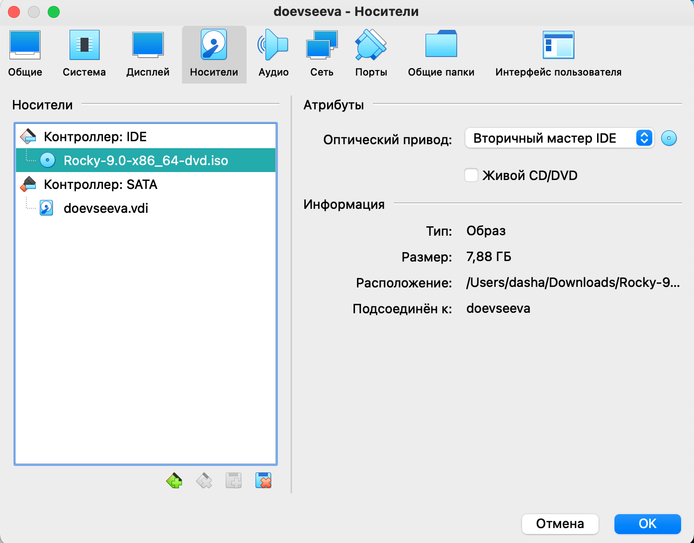
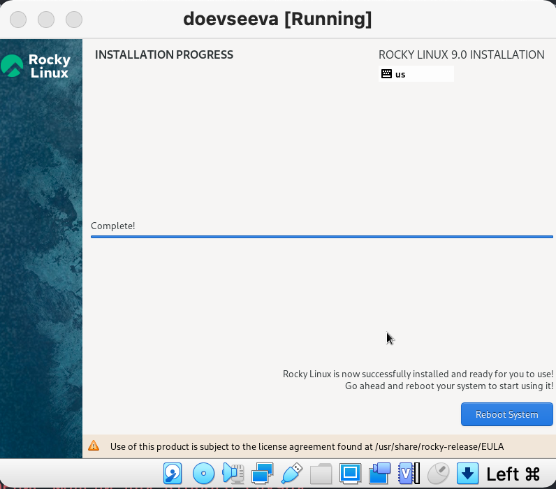
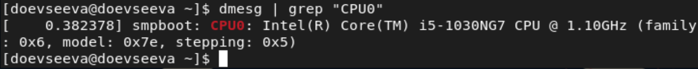

---
# Front matter
title: "Презентация о выполнении лабораторной работы №1"
subtitle: "Установка и конфигурация операционной системы на виртуальную машину"
author: "Евсеева Дарья Олеговна"
group: "НФИбд-01-19"
institute: "Российский Университет Дружбы Народов, Москва, Россия"
teacher: "Дмитрий Сергеевич Кулябов"
date: "10 сентября, 2022"

# Formatting
lang: ru-RU
toc: false
slide_level: 2
theme: metropolis
header-includes:
 - \metroset{sectionpage=none,numbering=fraction}
 - '\makeatletter'
 - '\beamer@ignorenonframefalse'
 - '\makeatother'
aspectratio: 43
section-titles: true
---

# Цель работы

Целью работы является приобретение практических навыков установки операционной системы на виртуальную машину, настройки минимально необходимых для дальнейшей работы сервисов.

# Задачи выполнения

Необходимо выполнить следующие задачи:

1. Выполнить установку и настройку виртуальной машины.
2. Получить информацию о системе.
3. Ответить на контрольные вопросы.

# Результаты выполнения

В ходе работы были выполнены поставленные задачи:

- Выполнена установка и настройка виртуальной машины

{ #fig:001 width=70% }

## Результаты выполнения

{ #fig:002 width=70% }

## Результаты выполнения

{ #fig:003 width=70% }

## Результаты выполнения

- Получена информацию о системе

{ #fig:004 width=70% }

## Результаты выполнения

{ #fig:005 width=70% }

## Результаты выполнения

- Найдены ответы на контрольные вопросы

# Выводы

В результате проделанной работы мы приобрели практические навыки установки операционной системы на виртуальную машину и настройки минимально необходимых для дальнейшей работы сервисов.
