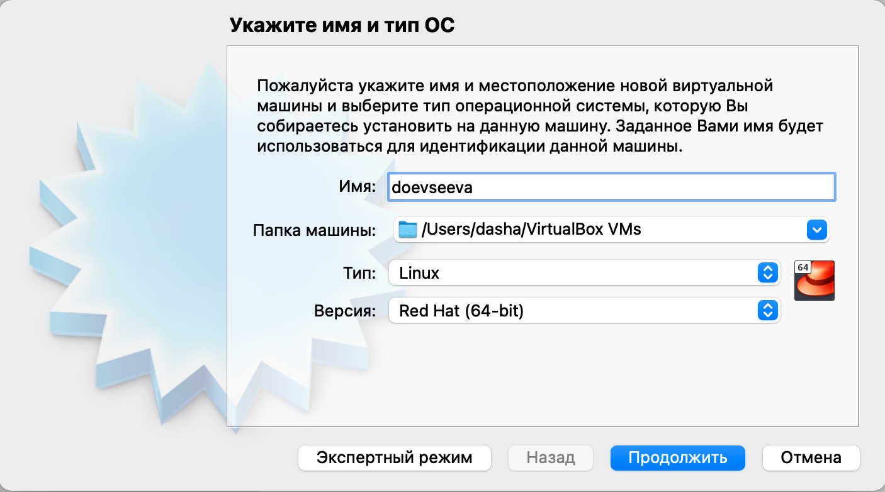
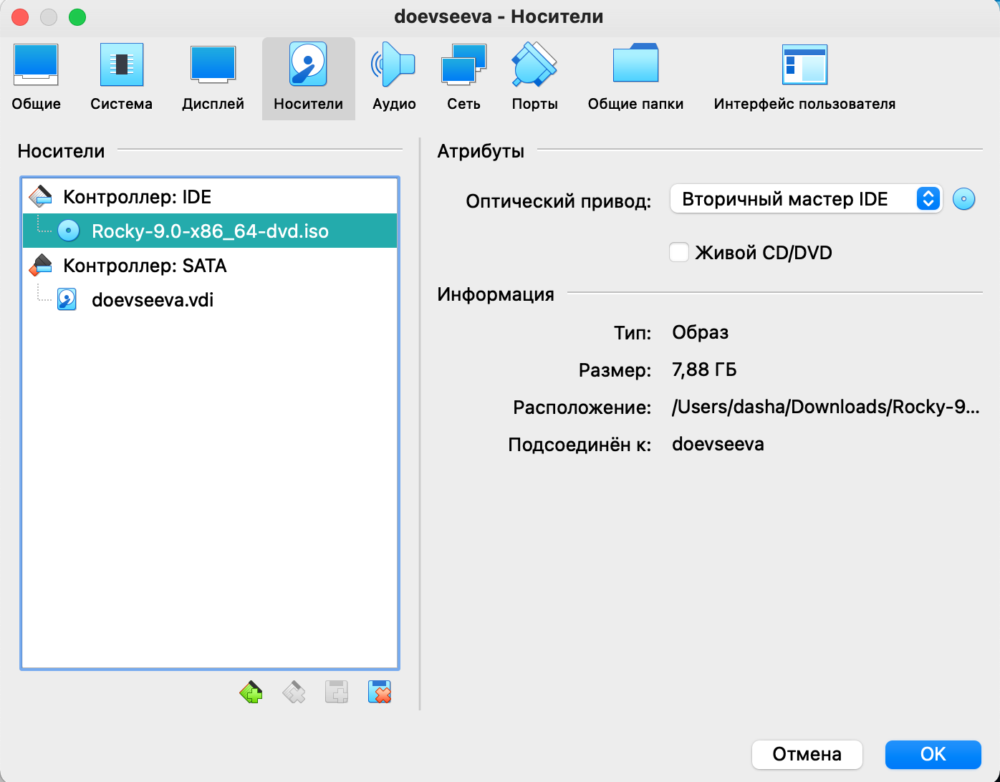
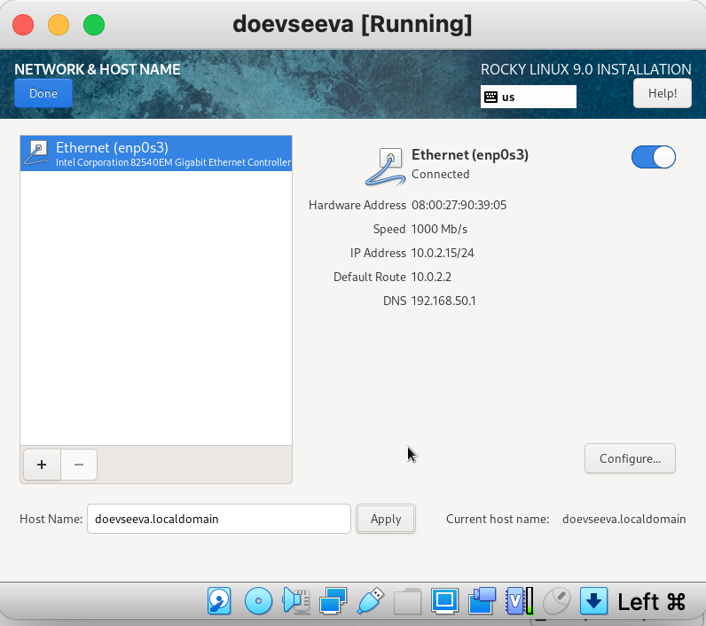
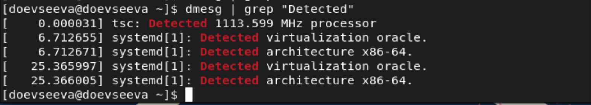

---
# Front matter
title: "Отчет по лабораторной работе №1"
subtitle: "Установка и конфигурация операционной системы на виртуальную машину"
author: "Евсеева Дарья Олеговна"
group: "НФИбд-01-19"
institute: "Российский Университет Дружбы Народов, Москва, Россия"
teacher: "Дмитрий Сергеевич Кулябов"
date: "10 сентября, 2022"

# Generic options
lang: ru-RU
toc-title: "Содержание"

# Bibliography
bibliography: bib/cite.bib
csl: pandoc/csl/gost-r-7-0-5-2008-numeric.csl

# Pdf output format
toc: true # Table of contents
toc_depth: 2
lof: true # List of figures
lot: false # List of tables
fontsize: 12pt
linestretch: 1.5
papersize: a4
documentclass: scrreprt
## I18n
polyglossia-lang:
  name: russian
  options:
	- spelling=modern
	- babelshorthands=true
polyglossia-otherlangs:
  name: english
### Fonts
mainfont: PT Serif
romanfont: PT Serif
sansfont: PT Sans
monofont: PT Mono
mainfontoptions: Ligatures=TeX
romanfontoptions: Ligatures=TeX
sansfontoptions: Ligatures=TeX,Scale=MatchLowercase
monofontoptions: Scale=MatchLowercase,Scale=0.9
## Biblatex
biblatex: true
biblio-style: "gost-numeric"
biblatexoptions:
  - parentracker=true
  - backend=biber
  - hyperref=auto
  - language=auto
  - autolang=other*
  - citestyle=gost-numeric
## Misc options
indent: true
header-includes:
  - \linepenalty=10 # the penalty added to the badness of each line within a paragraph (no associated penalty node) Increasing the value makes tex try to have fewer lines in the paragraph.
  - \interlinepenalty=0 # value of the penalty (node) added after each line of a paragraph.
  - \hyphenpenalty=50 # the penalty for line breaking at an automatically inserted hyphen
  - \exhyphenpenalty=50 # the penalty for line breaking at an explicit hyphen
  - \binoppenalty=700 # the penalty for breaking a line at a binary operator
  - \relpenalty=500 # the penalty for breaking a line at a relation
  - \clubpenalty=150 # extra penalty for breaking after first line of a paragraph
  - \widowpenalty=150 # extra penalty for breaking before last line of a paragraph
  - \displaywidowpenalty=50 # extra penalty for breaking before last line before a display math
  - \brokenpenalty=100 # extra penalty for page breaking after a hyphenated line
  - \predisplaypenalty=10000 # penalty for breaking before a display
  - \postdisplaypenalty=0 # penalty for breaking after a display
  - \floatingpenalty = 20000 # penalty for splitting an insertion (can only be split footnote in standard LaTeX)
  - \raggedbottom # or \flushbottom
  - \usepackage{float} # keep figures where there are in the text
  - \floatplacement{figure}{H} # keep figures where there are in the text
---

# Цель работы

Целью данной работы является приобретение практических навыков установки операционной системы на виртуальную машину, настройки минимально необходимых для дальнейшей работы сервисов.

# Задание

Выполнить установку и настройку виртуальной машины.

Получить информацию:

1. Версия ядра Linux (Linux version).
2. Частота процессора (Detected Mhz processor).
3. Модель процессора (CPU0).
4. Объем доступной оперативной памяти (Memory available).
5. Тип обнаруженного гипервизора (Hypervizor detected).
6. Тип файловой системы корневого раздела.
7. Последовательность монтирования файловых систем.

Ответить на контрольные вопросы:

1. Какую информацию содержит учетная запись пользователя?
2. Укажите команды терминала и приведите примеры:
    - для получения справки по команде;
    - для перемещения по файловой системе;
    - для просмотра содержимого каталога;
    - для определения объема каталога;
    - для создания / удаления каталогов / файлов;
    - для задания определенных прав на файл / каталог;
    - для просмотра истории команд.
3. Что такое файловая система? Приведите примеры с краткой характеристикой.
4. Как посмотреть, какие файловые системы подмонтированы в ОС?
5. Как удалить зависший процесс?

# Теоретическое введение

VirtualBox --- программный продукт виртуализации для таких операционных систем, как Windows, Linux, macOS и др.

Rocky Linux --- дистрибутив Linux, разработанный Rocky Enterprise Software Foundation для полной совместимости с Red Hat Enterprise Linux.

# Выполнение лабораторной работы

## 1. Создание виртуальной машины

Выполнять работу будем с использованием VirtualBox.

Выберем создание виртуальной машины. Укажем для нее имя и необходимый тип операционной системы --- Linux, RedHat.

{ #fig:001 width=70% }

Укажем размер основной памяти --- 2048 МБ.

{ #fig:002 width=70% }

Далее зададим конфигурацию жесткого диска - загрузочный, VDI, динамический виртуальный диск.

{ #fig:003 width=70% }

{ #fig:004 width=70% }

{ #fig:005 width=70% }

Зададим размер диска --- 40 ГБ.

{ #fig:006 width=70% }

Далее перейдем в настройки виртуальной машины в раздел *Носители* и добавим образ операционной системы, заранее скачанный с официального сайта.

{ #fig:007 width=70% }

## 2. Запуск виртуальной машины

Теперь запустим виртуальную машину и в качестве языка интерфейса выберем английский язык.

{ #fig:008 width=70% }

Перейдем к настройкам установки операционной системы. Добавим в раскладку клавиатуры русский язык и зададим комбинацию клавиш для переключения между раскладками.

{ #fig:009 width=70% }

В разделе выбора программ укажем в качестве базового окружения *Server with GUI*, а в качестве дополнения --- *Development Tools*.

{ #fig:010 width=70% }

Отключим KDUMP.

{ #fig:011 width=70% }

Включим сетевое соединение и в качестве имени узла укажем 'doevseeva.localdomain'.

{ #fig:012 width=70% }

Также установим пароль для root и пользователя с правами администратора, после чего приступим к установке операционной системы.

{ #fig:013 width=70% }

После завершения установки перезапустим виртуальную машину. Также проверим, что автоматическое отключение оптического диска прошло успешно.

Войдя в операционную систему, перейдем в меню *Устройства* виртуальной машины и подключим образ диска дополнений гостевой ОС.

{ #fig:014 width=70% }

{ #fig:015 width=70% }

## 3. Получение информации о системе

После успешной установки дополнений перейдем в терминал и выведем последовательность загрузки системы с помощью команды `dmesg`.

{ #fig:016 width=70% }

После этого получим в терминале некоторую информацию о системе.

Определим версию ядра Linux --- версия 5.14.0-70.13.1.el9_0.x86_64.

{ #fig:017 width=70% }

Найдем частоту процессора --- 1113.599 МГц.

{ #fig:018 width=70% }

Определим модель процессора --- Intel(R) Core(TM) i5-1030NG7.

{ #fig:019 width=70% }

Выведем информацию об объеме доступной оперативной памяти --- 260860K/2096696K.

{ #fig:020 width=70% }

Определим тип обнаруженного гипервизора --- KVM.

{ #fig:021 width=70% }

Также с помощью команды `df` определим тип файловой системы корневого каталога --- xfs.

{ #fig:022 width=70% }

{ #fig:023 width=70% }

Наконец, посмотрим последовательность монтирования файловых систем с помощью команды `mount`.

{ #fig:024 width=70% }

{ #fig:025 width=70% }

## 4. Ответы на контрольные вопросы

1. Какую информацию содержит учетная запись пользователя?

Учетная запись пользователя Linux содержит следующие сведения:

- Системное имя (user name)
- Идентификатор пользователя (UID)
- Идентификатор группы (GID)
- Полное имя (full name)
- Домашний каталог (home directory)
- Начальная оболочка (login shell)

2. Укажите команды терминала и приведите примеры:
  - для получения справки по команде;

Для получения справки по команде используется команда `man имя_команды`.

  - для перемещения по файловой системе;

Для перемещения по файловой системе используется команда `cd путь_к_каталогу`.

  - для просмотра содержимого каталога;

Для просмотра содержимого каталога используется команда `ls`.

  - для определения объема каталога;

Для определения объема каталога используется команда `du`.

  - для создания / удаления каталогов / файлов;

Для создания каталогов используется команда `mkdir имя_каталога`, для создания файлов --- `touch имя_файла`. Для удаления каталогов существует команда `rmdir имя_каталога`, для удаления файлов --- `rm имя_файла`.

  - для задания определенных прав на файл / каталог;

Для задания определенных прав на файл или каталог используется команда `chmod`. Например, чтобы разрешить всем категориям пользователей только чтение и запись файла, но не его выполнение, можно выполнить команду `chmod 666 имя_файла`.

  - для просмотра истории команд.

Для просмотра истории команд используется команда `history`.

3. Что такое файловая система? Приведите примеры с краткой характеристикой.

Файловая система --- это составляющая ОС, которая отвечает за организацию, хранение, чтение и запись файлов. В Linux файловая система представляет собой иерархическую структуру каталогов и файлов.

Примеры файловых систем:

Ext2, Ext3, Ext4 (Extended Filesystem) --- стандартная файловая система, содержит минимальное количество функций и является наиболее стабильной.

JFS (Journaled File System) --- используется там, где необходима высокая стабильность и минимальное потребление ресурсов.

XFS --- рассчитана на файлы большого размера, преимуществом является высокая скорость работы с большими файлами, отложенное выделение места, незначительный размер служебной информации.

4. Как посмотреть, какие файловые системы подмонтированы в ОС?

Для просмотра смонтированных файловых систем используется команда `mount`.

5. Как удалить зависший процесс?

Для удаления зависшего процесса используется команда `kill идентификатор_процесса`.

# Выводы

В результате проделанной работы мы приобрели практические навыки установки операционной системы на виртуальную машину и настройки минимально необходимых для дальнейшей работы сервисов.

# Список литературы{.unnumbered}

- Методические материалы к лабораторной работе, представленные на сайте "ТУИС РУДН" https://esystem.rudn.ru/

::: {#refs}
:::
