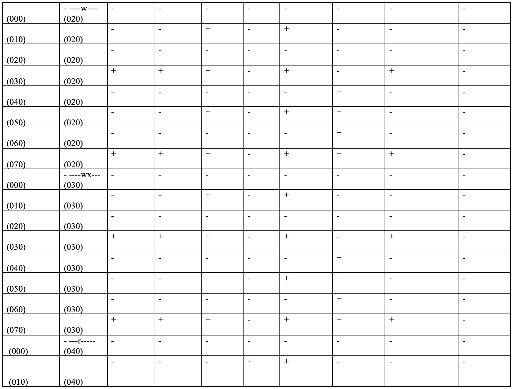

---
# Front matter
title: "Отчет по лабораторной работе №3"
subtitle: "Дискреционные разграничения прав в Linux. Два пользователя"
author: "Евсеева Дарья Олеговна"
group: "НФИбд-01-19"
institute: "Российский Университет Дружбы Народов, Москва, Россия"
teacher: "Дмитрий Сергеевич Кулябов"
date: "24 сентября, 2022"

# Generic options
lang: ru-RU
toc-title: "Содержание"

# Bibliography
bibliography: bib/cite.bib
csl: pandoc/csl/gost-r-7-0-5-2008-numeric.csl

# Pdf output format
toc: true # Table of contents
toc_depth: 2
lof: true # List of figures
lot: false # List of tables
fontsize: 12pt
linestretch: 1.5
papersize: a4
documentclass: scrreprt
## I18n
polyglossia-lang:
  name: russian
  options:
	- spelling=modern
	- babelshorthands=true
polyglossia-otherlangs:
  name: english
### Fonts
mainfont: PT Serif
romanfont: PT Serif
sansfont: PT Sans
monofont: PT Mono
mainfontoptions: Ligatures=TeX
romanfontoptions: Ligatures=TeX
sansfontoptions: Ligatures=TeX,Scale=MatchLowercase
monofontoptions: Scale=MatchLowercase,Scale=0.9
## Biblatex
biblatex: true
biblio-style: "gost-numeric"
biblatexoptions:
  - parentracker=true
  - backend=biber
  - hyperref=auto
  - language=auto
  - autolang=other*
  - citestyle=gost-numeric
## Misc options
indent: true
header-includes:
  - \linepenalty=10 # the penalty added to the badness of each line within a paragraph (no associated penalty node) Increasing the value makes tex try to have fewer lines in the paragraph.
  - \interlinepenalty=0 # value of the penalty (node) added after each line of a paragraph.
  - \hyphenpenalty=50 # the penalty for line breaking at an automatically inserted hyphen
  - \exhyphenpenalty=50 # the penalty for line breaking at an explicit hyphen
  - \binoppenalty=700 # the penalty for breaking a line at a binary operator
  - \relpenalty=500 # the penalty for breaking a line at a relation
  - \clubpenalty=150 # extra penalty for breaking after first line of a paragraph
  - \widowpenalty=150 # extra penalty for breaking before last line of a paragraph
  - \displaywidowpenalty=50 # extra penalty for breaking before last line before a display math
  - \brokenpenalty=100 # extra penalty for page breaking after a hyphenated line
  - \predisplaypenalty=10000 # penalty for breaking before a display
  - \postdisplaypenalty=0 # penalty for breaking after a display
  - \floatingpenalty = 20000 # penalty for splitting an insertion (can only be split footnote in standard LaTeX)
  - \raggedbottom # or \flushbottom
  - \usepackage{float} # keep figures where there are in the text
  - \floatplacement{figure}{H} # keep figures where there are in the text
---

# Цель работы

Целью данной работы является получение практических навыков работы в консоли с атрибутами файлов для групп пользователей.

# Задание

1. Создать второго гостевого пользователя и добавить его в группу.
2. Заполнить таблицы прав доступа для групп.

# Теоретическое введение

Дискреционное разграничение доступа --- подход к разграничению доступа, предполагающий назначение владельцев объектов, которые по собственному усмотрению определяют права доступа субъектов (других пользователей) к объектам (файлам), которыми владеют.

Дискреционные механизмы разграничения доступа используются для разграничения прав доступа процессов как обычных пользователей, так и для ограничения прав системных программ (например, служб операционной системы), которые работают от лица псевдопользовательских учетных записей.

# Выполнение лабораторной работы

Выполнять работу будем в операционной системе, установленной при выполнении первой лабораторной работы.

## 1. Создание и добавление пользователя в группу

Для начала, используя учетную запись администратора, создадим пользователя guest2 и установим для него пароль.

{ #fig:001 width=70% }

Далее добавим созданного пользователя в группу guest.

{ #fig:002 width=70% }

Войдем в систему от имени пользователя guest на одной консоли, и от имени созданного пользователя guest2 на второй консоли. Также проверим текущие директории пользователей с помощью команды `pwd`.

{ #fig:003 width=70% }

{ #fig:004 width=70% }

Мы видим, что для обоих пользователей результат выполнения команды совпадает с приглашением командной строки.

Далее выполним команду `id` для просмотра информации о пользователях. Также проверим вывод команд `groups`, `id -Gn` и `id -G`, сравнив результаты.

{ #fig:005 width=70% }

{ #fig:006 width=70% }

Здесь мы видим, что для каждого из пользователей выводы команд соответствуют действительности и не противоречат друг другу. Также можно заметить, что пользователя guest2 входит в две группы: guest2 и guest.

Посмотрим содержимое файла `/etc/group`.

{ #fig:007 width=70% }

{ #fig:008 width=70% }

Мы видим, что в последних двух строках вывода содержится информация о группах guest и guest2. Здесь мы также можем видеть, что пользователя guest2 дополнительно входит в группу guest.

Выполним регистрацию пользователя guest2 в группе guest.

{ #fig:009 width=70% }

Теперь от имени пользователя guest изменим права его домашней директории, разрешив все действия для пользователей группы, а затем снимем все атрибуты с директории dir1.

{ #fig:010 width=70% }

## 2. Заполнение таблиц прав доступа.

Заполним таблицу "Установленные права и разрешенные действия для групп", меняя атрибуты от имени пользователя guest и делая проверку от имени пользователя guest2, определив опытным путем, какие операции разрешены, а какие нет.

{ #fig:011 width=70% }

{ #fig:012 width=70% }

{ #fig:013 width=70% }

{ #fig:014 width=70% }

Итак, закончим заполнение таблицы "Установленные права и действия для групп".

{ #fig:015 width=70% }

{ #fig:016 width=70% }

{ #fig:017 width=70% }

{ #fig:018 width=70% }

Теперь, на основании заполненной таблицы определим те или иные минимально необходимые права для выполнения пользователем guest2 операций внутри директории dir1 и заполним таблицу "Минимальные права для совершения операций от имени пользователей, входящих в группу".

{ #fig:019 width=70% }

# Выводы

В результате проделанной работы мы приобрели практические навыки работы в консоли с атрибутами файлов для групп пользователей.

# Список литературы{.unnumbered}

- Методические материалы к лабораторной работе, представленные на сайте "ТУИС РУДН" https://esystem.rudn.ru/

::: {#refs}
:::
