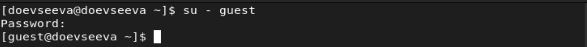
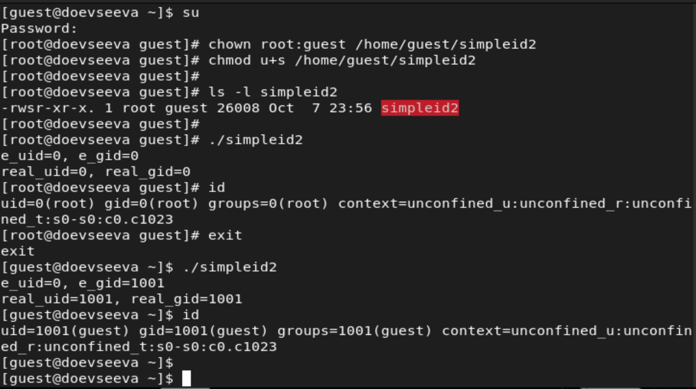
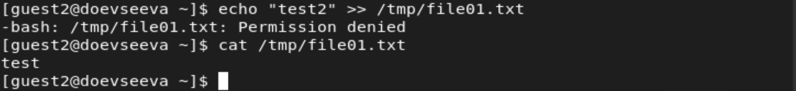
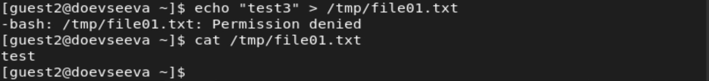
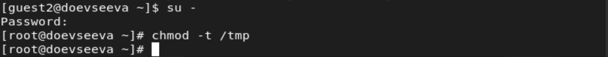
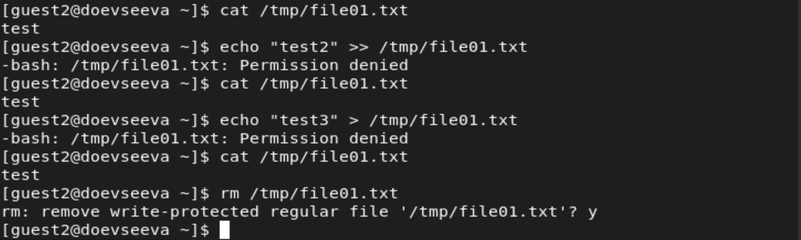

---
# Front matter
title: "Презентация о выполнении лабораторной работы №5"
subtitle: "Дискреционное разграничение прав в Linux. Исследование влияния дополнительных атрибутов"
author: "Евсеева Дарья Олеговна"
group: "НФИбд-01-19"
institute: "Российский Университет Дружбы Народов, Москва, Россия"
teacher: "Дмитрий Сергеевич Кулябов"
date: "8 октября, 2022"

# Formatting
lang: ru-RU
toc: false
slide_level: 2
theme: metropolis
header-includes:
 - \metroset{sectionpage=none,numbering=fraction}
 - '\makeatletter'
 - '\beamer@ignorenonframefalse'
 - '\makeatother'
aspectratio: 43
section-titles: true
---

# Цель работы

Целью работы является изучение механизмов изменения идентификаторов и применения SetUID-, SetGID- и Sticky-битов, получение практических навыков работы в консоли с дополнительными атрибутами, рассмотрение работы механизма смены идентификатора процессов пользователей, а также влияние бита Sticky на запись и удаление файлов.

# Задачи выполнения

Необходимо выполнить следующие задачи:

1. Провести работу с SetUID- и SetGID-битами.
2. Провести работу со Sticky-битом.

# Результаты выполнения

В ходе работы были выполнены поставленные задачи:

- Проведена работа с SetUID- и SetGID-битами

{ #fig:001 width=70% }

{ #fig:002 width=70% }

## Результаты выполнения

{ #fig:003 width=70% }

## Результаты выполнения

{ #fig:004 width=70% }

## Результаты выполнения

{ #fig:005 width=70% }

{ #fig:006 width=70% }

## Результаты выполнения

{ #fig:007 width=70% }

## Результаты выполнения

{ #fig:008 width=70% }

## Результаты выполнения

- Проведена работа со Sticky-битом

{ #fig:009 width=70%

## Результаты выполнения

{ #fig:010 width=70% }

{ #fig:011 width=70% }

## Результаты выполнения

{ #fig:012 width=70% }

{ #fig:013 width=70% }

## Результаты выполнения

{ #fig:014 width=70% }

{ #fig:015 width=70% }

## Результаты выполнения

{ #fig:016 width=70% }

# Выводы

В результате проделанной работы мы изучили механизмы изменения идентификаторов и применения SetUID-, SetGID- и Sticky-битов, получили практические навыки работы в консоли с дополнительными атрибутами, рассмотрели работу механизма смены идентификатора процессов пользователей, а также влияние бита Sticky на запись и удаление файлов.
