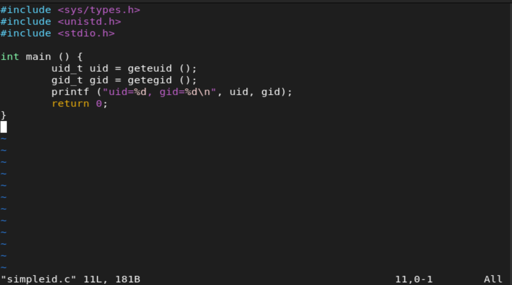
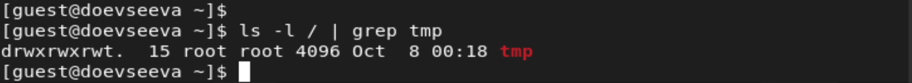

---
# Front matter
title: "Отчет по лабораторной работе №5"
subtitle: "Дискреционное разграничение прав в Linux. Исследование влияния дополнительных атрибутов"
author: "Евсеева Дарья Олеговна"
group: "НФИбд-01-19"
institute: "Российский Университет Дружбы Народов, Москва, Россия"
teacher: "Дмитрий Сергеевич Кулябов"
date: "8 октября, 2022"

# Generic options
lang: ru-RU
toc-title: "Содержание"

# Bibliography
bibliography: bib/cite.bib
csl: pandoc/csl/gost-r-7-0-5-2008-numeric.csl

# Pdf output format
toc: true # Table of contents
toc_depth: 2
lof: true # List of figures
lot: false # List of tables
fontsize: 12pt
linestretch: 1.5
papersize: a4
documentclass: scrreprt
## I18n
polyglossia-lang:
  name: russian
  options:
	- spelling=modern
	- babelshorthands=true
polyglossia-otherlangs:
  name: english
### Fonts
mainfont: PT Serif
romanfont: PT Serif
sansfont: PT Sans
monofont: PT Mono
mainfontoptions: Ligatures=TeX
romanfontoptions: Ligatures=TeX
sansfontoptions: Ligatures=TeX,Scale=MatchLowercase
monofontoptions: Scale=MatchLowercase,Scale=0.9
## Biblatex
biblatex: true
biblio-style: "gost-numeric"
biblatexoptions:
  - parentracker=true
  - backend=biber
  - hyperref=auto
  - language=auto
  - autolang=other*
  - citestyle=gost-numeric
## Misc options
indent: true
header-includes:
  - \linepenalty=10 # the penalty added to the badness of each line within a paragraph (no associated penalty node) Increasing the value makes tex try to have fewer lines in the paragraph.
  - \interlinepenalty=0 # value of the penalty (node) added after each line of a paragraph.
  - \hyphenpenalty=50 # the penalty for line breaking at an automatically inserted hyphen
  - \exhyphenpenalty=50 # the penalty for line breaking at an explicit hyphen
  - \binoppenalty=700 # the penalty for breaking a line at a binary operator
  - \relpenalty=500 # the penalty for breaking a line at a relation
  - \clubpenalty=150 # extra penalty for breaking after first line of a paragraph
  - \widowpenalty=150 # extra penalty for breaking before last line of a paragraph
  - \displaywidowpenalty=50 # extra penalty for breaking before last line before a display math
  - \brokenpenalty=100 # extra penalty for page breaking after a hyphenated line
  - \predisplaypenalty=10000 # penalty for breaking before a display
  - \postdisplaypenalty=0 # penalty for breaking after a display
  - \floatingpenalty = 20000 # penalty for splitting an insertion (can only be split footnote in standard LaTeX)
  - \raggedbottom # or \flushbottom
  - \usepackage{float} # keep figures where there are in the text
  - \floatplacement{figure}{H} # keep figures where there are in the text
---

# Цель работы

Целью данной работы является изучение механизмов изменения идентификаторов и применения SetUID-, SetGID- и Sticky-битов, получение практических навыков работы в консоли с дополнительными атрибутами, рассмотрение работы механизма смены идентификатора процессов пользователей, а также влияние бита Sticky на запись и удаление файлов.

# Задание

1. Провести работу с SetUID- и SetGID-битами.
2. Провести работу со Sticky-битом.

# Теоретическое введение

Дискреционное разграничение доступа --- подход к разграничению доступа, предполагающий назначение владельцев объектов, которые по собственному усмотрению определяют права доступа субъектов (других пользователей) к объектам (файлам), которыми владеют.

Дискреционные механизмы разграничения доступа используются для разграничения прав доступа процессов как обычных пользователей, так и для ограничения прав системных программ (например, служб операционной системы), которые работают от лица псевдопользовательских учетных записей.

# Выполнение лабораторной работы

Выполнять работу будем в операционной системе, установленной при выполнении первой лабораторной работы.

## 1. Работа с SetUID- и SetGID-битами

Для начала войдем в систему от имени пользователя guest.

{ #fig:001 width=70% }

Далее создадим файл simpleid.c и запишем в него код программы.

{ #fig:002 width=70% }

{ #fig:003 width=70% }

Скомпилируем программу и выполним ее, сравнив результаты с выводом команды `id`.

{ #fig:004 width=70% }

Мы видим, что результаты вывода программы и команды совпадают и соответствуют действительности.

Далее создадим файл simpleid2.c и запишем в него ранее написанную программу, добавив вывод действительных идентификаторов.

{ #fig:005 width=70% }

{ #fig:006 width=70% }

Скомпилируем и запустим программу.

{ #fig:007 width=70% }

Здесь мы видим, что полученные значения для пар `uid` и `gid` совпадают.

Далее от имени суперпользователя сменим владельца файла simpleid2 и установим на него атрибут `s` для пользователя, после чего проверим правильность выполненных команд и сравним результат запуска simpleid2 с выводом команды `id` для суперпользователя и для пользователя guest.

{ #fig:008 width=70% }

Мы видим, что при выводе результатов от имени суперпользователя все результаты совпадают по значениям, однако при выводе результатов от имени пользователя guest можно заметить, что значение `e_uid` остается соответствующим суперпользователю, а остальные значения соответствуют значениям для пользователя guest.

Далее проделаем те же действия, установив на файл от имени суперпользователя атрибут `s` для группы.

{ #fig:009 width=70% }

Здесь мы видим, что при выводе результатов от имени суперпользователя все результаты совпадают по значениям, кроме значения `g_uid`, которое соответствует группе guest, а при выводе результатов от имени пользователя guest значение `e_uid` остается соответствующим суперпользователю, а значение `g_uid` с остальными результатами также соответствует группе и пользователю guest.

Теперь создадим программу readfile.c и откомпилируем ее.

{ #fig:010 width=70% }

{ #fig:011 width=70% }

{ #fig:012 width=70% }

Сменим владельца у файла readfile.c и изменим права так, чтобы только суперпользователь мог прочитать его, а guest не мог, и проверим успешность изменения прав.

{ #fig:013 width=70% }

Далее сменим у программы readfile владельца и установим SetUID-бит.

{ #fig:014 width=70% }

Проверим возможность чтения программой readfile файлов readfile.c и /etc/shadow от имени суперпользователя и пользователя guest.

{ #fig:015 width=70% }

{ #fig:016 width=70% }

{ #fig:017 width=70% }

{ #fig:018 width=70% }

Как мы видим, файлы были успешно прочитаны в обоих случаях.

## 2. Работа со Sticky-битом

Выясним, установлен ли атрибут Sticky на директории /tmp.

{ #fig:019 width=70% }

Мы видим, что атрибут `t` установлен на директории.

От имени пользователя guest создадим файл file01.txt в директории /tmp со словом test, просмотрим его атрибуты и разрешим чтение и запись для категории пользователей 'все остальные'.

{ #fig:020 width=70% }

От имени пользователя guest2 попробуем прочитать созданный файл.

{ #fig:021 width=70% }

Файл был успешно прочитан.

Далее попробуем сделать дозапись в файл, перезаписать его содержимое и удалить файл.

{ #fig:022 width=70% }

{ #fig:023 width=70% }

{ #fig:024 width=70% }

При попытке выполнения каждой из команд было отказано в доступе, соответственно выполнить их не удалось.

Повысим свои права до суперпользователя и снимем атрибут `t` с директории /tmp.

{ #fig:025 width=70% }

Покинем режим суперпользователя и проверим успешность снятия атрибута.

{ #fig:026 width=70% }

Далее попробуем выполнить команды, которые не удалось выполнить ранее.

{ #fig:027 width=70% }

Итак, мы можем видеть, что при попытке дозаписи в файл или перезаписи его содержимого в доступе снова было отказано, однако на этот раз удалось успешно удалить файл от имени пользователя, не являющегося его владельцем.

Повысим свои права до суперпользователя и вернем атрибут `t` на директорию /tmp.

{ #fig:028 width=70% }

# Выводы

В результате проделанной работы мы изучили механизмы изменения идентификаторов и применения SetUID-, SetGID- и Sticky-битов, получили практические навыки работы в консоли с дополнительными атрибутами, рассмотрели работу механизма смены идентификатора процессов пользователей, а также влияние бита Sticky на запись и удаление файлов.

# Список литературы{.unnumbered}

- Методические материалы к лабораторной работе, представленные на сайте "ТУИС РУДН" https://esystem.rudn.ru/

::: {#refs}
:::
