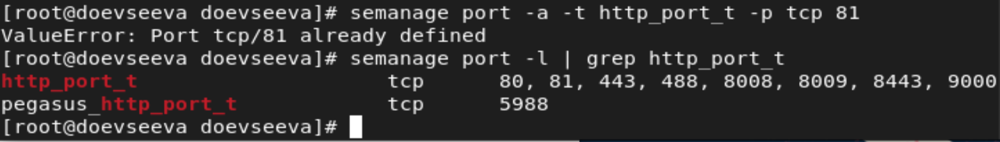

---
# Front matter
title: "Презентация о выполнении лабораторной работы №6"
subtitle: "Мандатное разграничение прав в Linux"
author: "Евсеева Дарья Олеговна"
group: "НФИбд-01-19"
institute: "Российский Университет Дружбы Народов, Москва, Россия"
teacher: "Дмитрий Сергеевич Кулябов"
date: "15 октября, 2022"

# Formatting
lang: ru-RU
toc: false
slide_level: 2
theme: metropolis
header-includes:
 - \metroset{sectionpage=none,numbering=fraction}
 - '\makeatletter'
 - '\beamer@ignorenonframefalse'
 - '\makeatother'
aspectratio: 43
section-titles: true
---

# Цель работы

Целью работы является развитие навыков администрирования ОС Linux, ознакомление с технологией SELinux, а также проверка работы SELinux на практике совместно с веб-сервером Apache.

# Задачи выполнения

Необходимо провести работу с SELinux и веб-сервером Apache.

# Результаты выполнения

В ходе работы были выполнены поставленные задачи:

- Проведена работа с SELinux и веб-сервером Apache

{ #fig:001 width=70% }

## Результаты выполнения

{ #fig:002 width=70% }

{ #fig:003 width=70% }

## Результаты выполнения

{ #fig:004 width=70% }

{ #fig:005 width=70% }

## Результаты выполнения

{ #fig:006 width=70% }

{ #fig:007 width=70% }

## Результаты выполнения

{ #fig:008 width=70% }

{ #fig:009 width=70% }

## Результаты выполнения

{ #fig:010 width=70% }

{ #fig:011 width=70% }

## Результаты выполнения

{ #fig:012 width=70% }

# Выводы

В результате проделанной работы мы развили навыки администрирования ОС Linux, ознакомились с технологией SELinux, а также проверили работу SELinux на практике совместно с веб-сервером Apache.
