---
# Front matter
title: "Отчет по лабораторной работе №6"
subtitle: "Мандатное разграничение прав в Linux"
author: "Евсеева Дарья Олеговна"
group: "НФИбд-01-19"
institute: "Российский Университет Дружбы Народов, Москва, Россия"
teacher: "Дмитрий Сергеевич Кулябов"
date: "15 октября, 2022"

# Generic options
lang: ru-RU
toc-title: "Содержание"

# Bibliography
bibliography: bib/cite.bib
csl: pandoc/csl/gost-r-7-0-5-2008-numeric.csl

# Pdf output format
toc: true # Table of contents
toc_depth: 2
lof: true # List of figures
lot: false # List of tables
fontsize: 12pt
linestretch: 1.5
papersize: a4
documentclass: scrreprt
## I18n
polyglossia-lang:
  name: russian
  options:
	- spelling=modern
	- babelshorthands=true
polyglossia-otherlangs:
  name: english
### Fonts
mainfont: PT Serif
romanfont: PT Serif
sansfont: PT Sans
monofont: PT Mono
mainfontoptions: Ligatures=TeX
romanfontoptions: Ligatures=TeX
sansfontoptions: Ligatures=TeX,Scale=MatchLowercase
monofontoptions: Scale=MatchLowercase,Scale=0.9
## Biblatex
biblatex: true
biblio-style: "gost-numeric"
biblatexoptions:
  - parentracker=true
  - backend=biber
  - hyperref=auto
  - language=auto
  - autolang=other*
  - citestyle=gost-numeric
## Misc options
indent: true
header-includes:
  - \linepenalty=10 # the penalty added to the badness of each line within a paragraph (no associated penalty node) Increasing the value makes tex try to have fewer lines in the paragraph.
  - \interlinepenalty=0 # value of the penalty (node) added after each line of a paragraph.
  - \hyphenpenalty=50 # the penalty for line breaking at an automatically inserted hyphen
  - \exhyphenpenalty=50 # the penalty for line breaking at an explicit hyphen
  - \binoppenalty=700 # the penalty for breaking a line at a binary operator
  - \relpenalty=500 # the penalty for breaking a line at a relation
  - \clubpenalty=150 # extra penalty for breaking after first line of a paragraph
  - \widowpenalty=150 # extra penalty for breaking before last line of a paragraph
  - \displaywidowpenalty=50 # extra penalty for breaking before last line before a display math
  - \brokenpenalty=100 # extra penalty for page breaking after a hyphenated line
  - \predisplaypenalty=10000 # penalty for breaking before a display
  - \postdisplaypenalty=0 # penalty for breaking after a display
  - \floatingpenalty = 20000 # penalty for splitting an insertion (can only be split footnote in standard LaTeX)
  - \raggedbottom # or \flushbottom
  - \usepackage{float} # keep figures where there are in the text
  - \floatplacement{figure}{H} # keep figures where there are in the text
---

# Цель работы

Целью данной работы является развитие навыков администрирования ОС Linux, ознакомление с технологией SELinux, а также проверка работы SELinux на практике совместно с веб-сервером Apache.

# Задание

Провести работу с SELinux и веб-сервером Apache.

# Теоретическое введение

Мандатное управление доступом (Mandatory Access Control, MAC) - это система разграничения доступа на основе уровня доступа субъекта и защитной метки объекта. Смысл состоит в том, что субъект может получить доступ к тем объектам, у которых метка безопасности имеет тот же уровень или ниже, что и у объекта.

Субъект - это пользователь, вернее процесс, который он инициализирует. Объект - это файл, программа, база данных и любой из ее объектов, даже сетевой пакет. Также предусмотрена иерархическая структура уровней доступа. Всем субъектам и объектам назначаются так называемые метки - значение уровня доступа у субъекта и значение уровня конфиденциальности для объекта.

Каждый раз, когда субъект запрашивает объект происходит проверка соответствия меток и принимается решение о разрешении или запрете доступа. Так как структура уровней доступа иерархическая, то субъект имеет доступ к объектам соответствующего уровня конфиденциальности, а также ко всем другим уровням, находящимся по иерархии ниже. Проверка уровня доступа это вертикальная безопасность, но в MAC предусмотрена и горизонтальная. В дополнение к уровням безопасности, существуют категории. Благодаря им можно разграничивать доступ среди субъектов с одинаковым уровнем доступа.

# Выполнение лабораторной работы

Выполнять работу будем в операционной системе, установленной при выполнении первой лабораторной работы.

## Работа с SELinux и веб-сервером Apache

Для начала войдем в систему и убедимся, что SELinux работает в режиме enforcing политики targeted.

{ #fig:001 width=70% }

Далее, обратимся с помощью браузера к веб-серверу и убедимся, что последний работает.

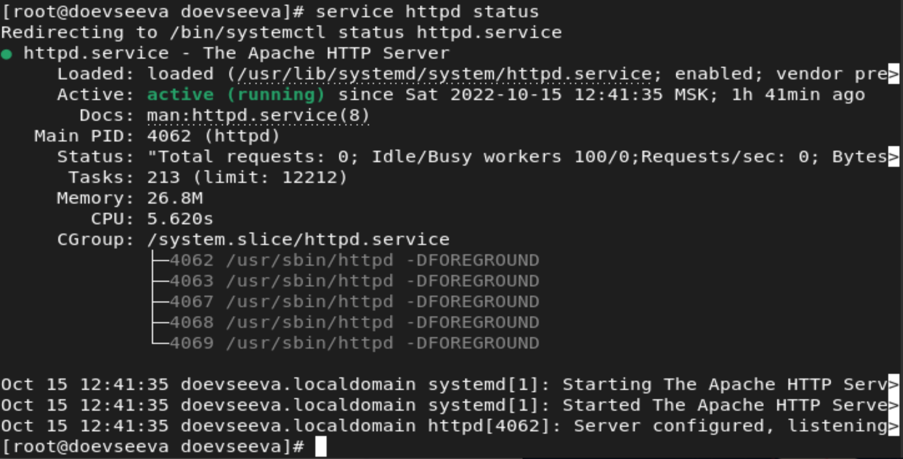{ #fig:002 width=70% }

Найдем веб-сервер Apache в списке процессов и определим его контекст безопасности.

{ #fig:003 width=70% }

Как мы видим, контекст веб-сервера Apache --- system_u:system_r:httpd_t:s0.

Посмотрим текущее состояние переключателей SELinux для Apache.

{ #fig:004 width=70% }

Мы видим, что многие выключатели находятся в положении 'off'.

Посмотрим статистику по политике с помощью команды `seinfo` и определим множество пользователей, ролей и типов.

{ #fig:005 width=70% }

Здесь мы видим, что множество пользователей состоит из 4 пользователей, во множестве ролей находится 14 ролей, а во множестве типов --- 5002 типа.

Далее посмотрим на содержимое директории `/var/www`.

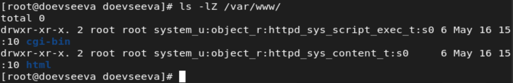{ #fig:006 width=70% }

Мы видим, что в директории находятся две поддиректории.

Также определим содержимое директории `/var/www/html`.

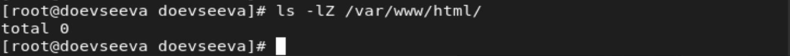{ #fig:007 width=70% }

Мы видим, что в данной директории нет файлов или поддиректорий.

Чтобы определить круг пользователей, который разрешено создание файлов в директории `/var/www/html`, посмотрим на вывод команды на рис.6. Как мы видим, создание файлов в данной директории разрешено только для пользователя, который является владельцем директории.

Создадим от имени суперпользователя html-файл `/var/www/html/test.html`.

{ #fig:008 width=70% }

{ #fig:009 width=70% }

Далее проверим контекст созданного файла.

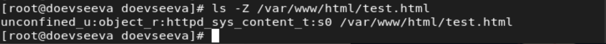{ #fig:010 width=70% }

Мы видим, что контекст, присваиваемый по умолчанию файлам, созданным в данной директории --- это unconfined_u:object_r:httpd_system_content_t:s0.

Обратимся к файлу через веб-сервер.

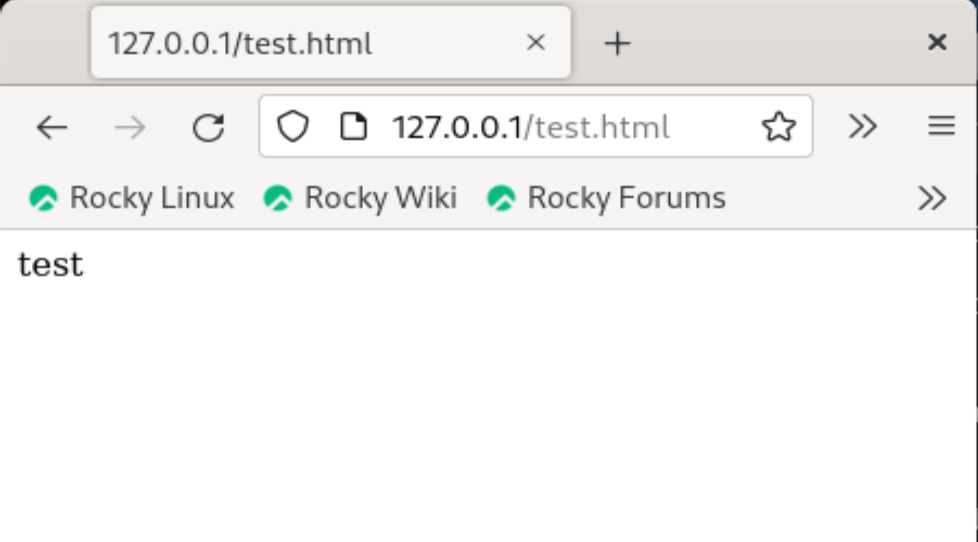{ #fig:011 width=70% }

Как мы видим, файл успешно отображается.

Изучим справку `man httpd_selinux` и найдем в ней контекст, соответствующий созданному файлу.

{ #fig:012 width=70% }

{ #fig:013 width=70% }

Изменим контекст файла на такой, к которому процесс httpd не должен иметь доступа, и проверим успешность изменения контекста.

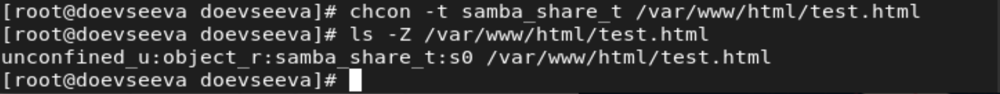{ #fig:014 width=70% }

Еще раз попробуем получиться доступ к файлу через веб-сервер, а также проверим права доступа к файлу.

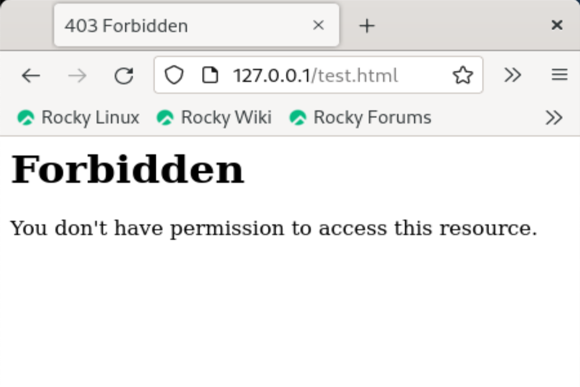{ #fig:015 width=70% }

{ #fig:016 width=70% }

Мы видим, что на этот раз в доступе было отказано, и файл не был отображен. Несмотря на то, что доступ на чтение файла является открытым, файл не отображается из-за того, что ранее мы поменяли его контекст на такой, к которому нет доступа у процесса httpd.

Просмотрим лог-файлы веб-сервера Apache, а также системный лог-файл.

{ #fig:017 width=70% }

{ #fig:018 width=70% }

{ #fig:019 width=70% }

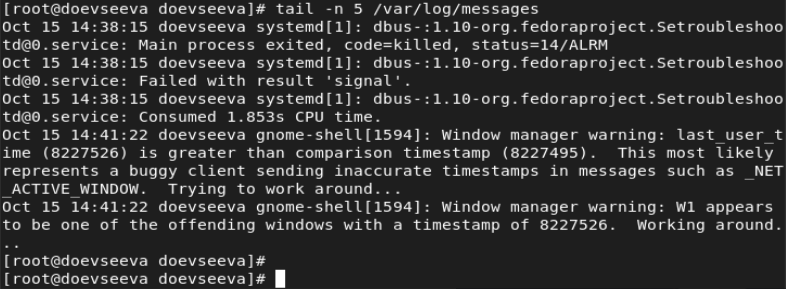{ #fig:020 width=70% }

Теперь попробуем запустить веб-сервер Apache на прослушивание TCP-порта 81, для чего внесем изменения в файл `/etc/httpd/conf/httpd.conf`.

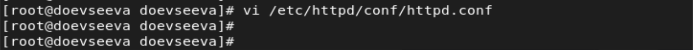{ #fig:021 width=70% }

{ #fig:022 width=70% }

Выполним перезапуск веб-сервера Apache.

{ #fig:023 width=70% }

Далее просмотрим лог-файлы.

{ #fig:024 width=70% }

{ #fig:025 width=70% }

{ #fig:026 width=70% }

{ #fig:027 width=70% }

Мы можем заметить, что в каждом из лог-файлов появились записи.

Выполним команду `semanage port` и проверим список портов.

{ #fig:028 width=70% }

Мы видим, что в нашей системе порт 81 изначально находился в списке.

Еще раз попробуем перезапустить веб-сервер Apache.

{ #fig:029 width=70% }

Вернем изначальный контекст созданному файлу, и попробуем получить к нему доступ через веб-сервер.

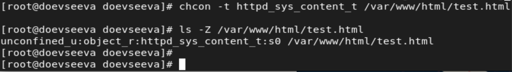{ #fig:030 width=70% }

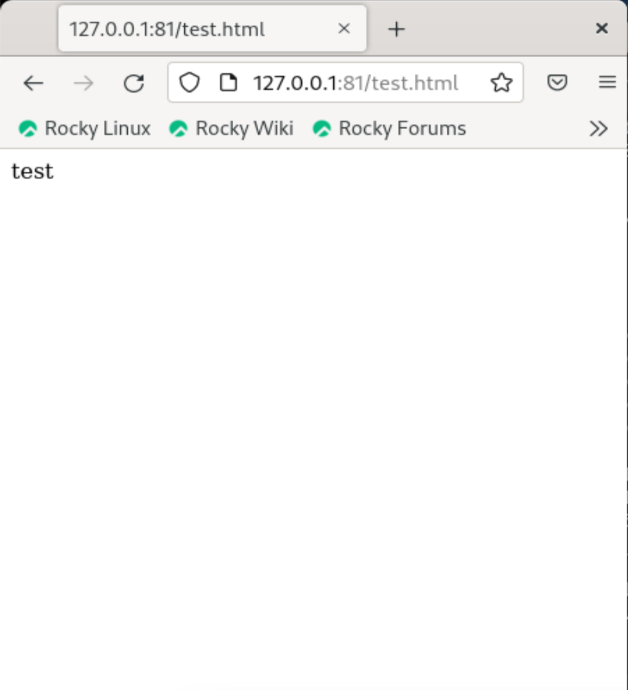{ #fig:031 width=70% }

Мы видим, что содержимое файла успешно отобразилось.

Исправим конфигурационный файл Apache, вернув 'Listen 80'.

{ #fig:032 width=70% }

Удалим привязку к 81 порту.

{ #fig:033 width=70% }

Как мы видим, в нашей системе мы не можем удалить привязку к данному порту.

Удалим созданный html-файл.

{ #fig:034 width=70% }

# Выводы

В результате проделанной работы мы развили навыки администрирования ОС Linux, ознакомились с технологией SELinux, а также проверили работу SELinux на практике совместно с веб-сервером Apache.

# Список литературы{.unnumbered}

- Методические материалы к лабораторной работе, представленные на сайте "ТУИС РУДН" https://esystem.rudn.ru/

::: {#refs}
:::
