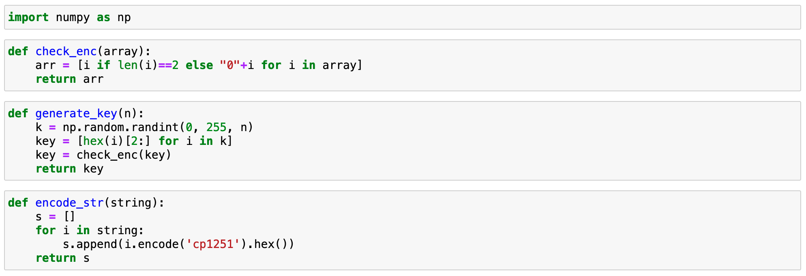
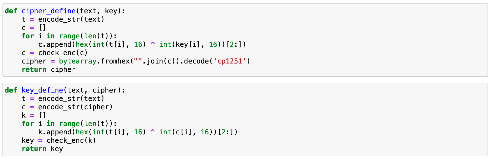
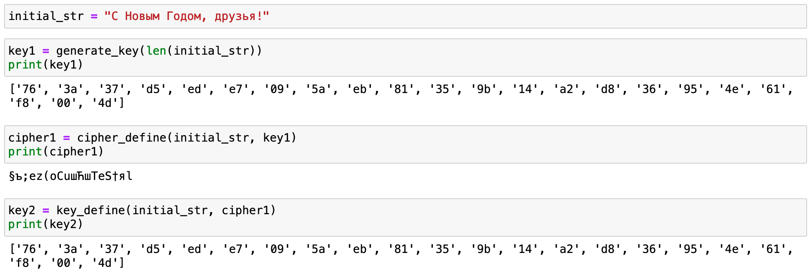

---
# Front matter
title: "Презентация о выполнении лабораторной работы №7"
subtitle: "Элементы криптографии. Однократное гаммирование"
author: "Евсеева Дарья Олеговна"
group: "НФИбд-01-19"
institute: "Российский Университет Дружбы Народов, Москва, Россия"
teacher: "Дмитрий Сергеевич Кулябов"
date: "22 октября, 2022"

# Formatting
lang: ru-RU
toc: false
slide_level: 2
theme: metropolis
header-includes:
 - \metroset{sectionpage=none,numbering=fraction}
 - '\makeatletter'
 - '\beamer@ignorenonframefalse'
 - '\makeatother'
aspectratio: 43
section-titles: true
---

# Цель работы

Целью работы является освоение на практике применения режима однократного гаммирования.

# Задачи выполнения

Необходимо разработать приложение, позволяющее шифровать и дешифровать данные в режиме однократного гаммирования, которое должно:

1. Определить вид шифротекста при известном ключе и известном открытом тексте.
2. Определить ключ, с помощью которого шифротекст может быть преобразован в некоторый фрагмент текста, представляющий собой один из возможных вариантов прочтения открытого текста.

# Результаты выполнения

В ходе работы были выполнены поставленные задачи:

- Разработано приложение, позволяющее шифровать и дешифровать данные в режиме однократного гаммирования

{ #fig:001 width=70% }

## Результаты выполнения

{ #fig:002 width=70%

## Результаты выполнения

{ #fig:003 width=70% }

# Выводы

В результате проделанной работы мы освоили на практике применение режима однократного гаммирования.
