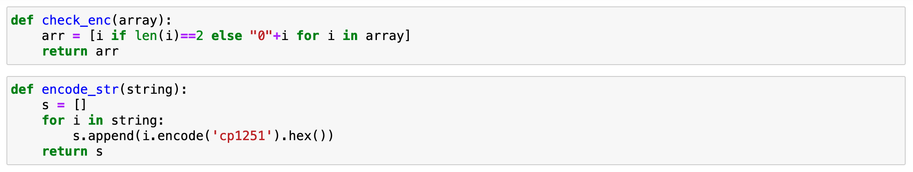
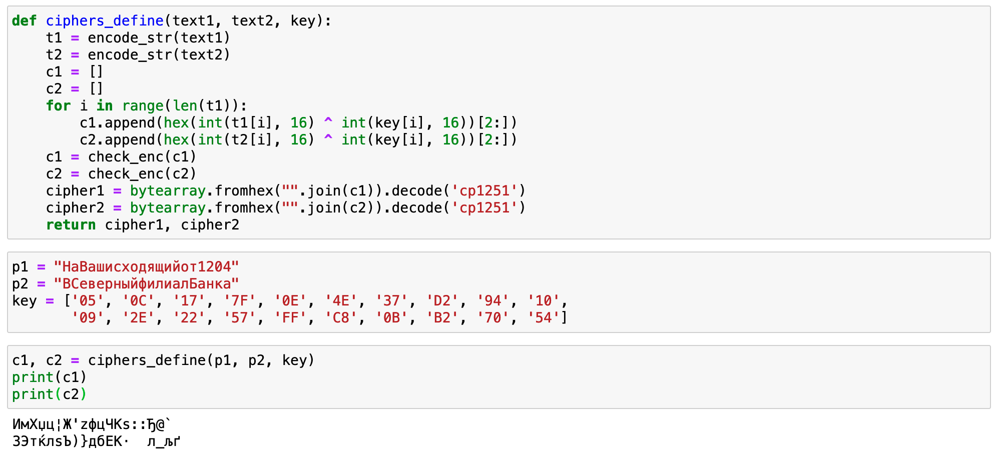
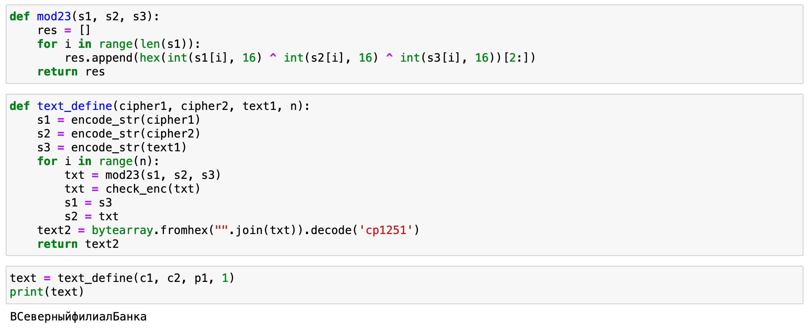

---
# Front matter
title: "Отчет по лабораторной работе №8"
subtitle: "Элементы криптографии. Шифрование различных исходных текстов одним ключом"
author: "Евсеева Дарья Олеговна"
group: "НФИбд-01-19"
institute: "Российский Университет Дружбы Народов, Москва, Россия"
teacher: "Дмитрий Сергеевич Кулябов"
date: "29 октября, 2022"

# Generic options
lang: ru-RU
toc-title: "Содержание"

# Bibliography
bibliography: bib/cite.bib
csl: pandoc/csl/gost-r-7-0-5-2008-numeric.csl

# Pdf output format
toc: true # Table of contents
toc_depth: 2
lof: true # List of figures
lot: false # List of tables
fontsize: 12pt
linestretch: 1.5
papersize: a4
documentclass: scrreprt
## I18n
polyglossia-lang:
  name: russian
  options:
	- spelling=modern
	- babelshorthands=true
polyglossia-otherlangs:
  name: english
### Fonts
mainfont: PT Serif
romanfont: PT Serif
sansfont: PT Sans
monofont: PT Mono
mainfontoptions: Ligatures=TeX
romanfontoptions: Ligatures=TeX
sansfontoptions: Ligatures=TeX,Scale=MatchLowercase
monofontoptions: Scale=MatchLowercase,Scale=0.9
## Biblatex
biblatex: true
biblio-style: "gost-numeric"
biblatexoptions:
  - parentracker=true
  - backend=biber
  - hyperref=auto
  - language=auto
  - autolang=other*
  - citestyle=gost-numeric
## Misc options
indent: true
header-includes:
  - \linepenalty=10 # the penalty added to the badness of each line within a paragraph (no associated penalty node) Increasing the value makes tex try to have fewer lines in the paragraph.
  - \interlinepenalty=0 # value of the penalty (node) added after each line of a paragraph.
  - \hyphenpenalty=50 # the penalty for line breaking at an automatically inserted hyphen
  - \exhyphenpenalty=50 # the penalty for line breaking at an explicit hyphen
  - \binoppenalty=700 # the penalty for breaking a line at a binary operator
  - \relpenalty=500 # the penalty for breaking a line at a relation
  - \clubpenalty=150 # extra penalty for breaking after first line of a paragraph
  - \widowpenalty=150 # extra penalty for breaking before last line of a paragraph
  - \displaywidowpenalty=50 # extra penalty for breaking before last line before a display math
  - \brokenpenalty=100 # extra penalty for page breaking after a hyphenated line
  - \predisplaypenalty=10000 # penalty for breaking before a display
  - \postdisplaypenalty=0 # penalty for breaking after a display
  - \floatingpenalty = 20000 # penalty for splitting an insertion (can only be split footnote in standard LaTeX)
  - \raggedbottom # or \flushbottom
  - \usepackage{float} # keep figures where there are in the text
  - \floatplacement{figure}{H} # keep figures where there are in the text
---

# Цель работы

Целью данной работы является освоение на практике применения режима однократного гаммирования на примере кодирования различных исходных текстов одним ключом.

# Задание

Разработать приложение, позволяющее шифровать и дешифровать данные в режиме однократного гаммирования.

Приложение должно:

1. Определить вид шифротекстов двух открытых текстов при известном ключе.
2. Не зная ключа и не стремясь его определить прочитать оба текста.

# Теоретическое введение

Гаммирование представляет собой наложение (снятие) на открытые (зашифрованные) данные последовательности элементов других данных, полученной с помощью некоторого криптографического алгоритма, для получения зашифрованных (открытых) данных. Иными словами, наложение гаммы — это сложение её элементов с элементами открытого (закрытого) текста по некоторому фиксированному модулю, значение которого представляет собой известную часть алгоритма шифрования.

В соответствии с теорией криптоанализа, если в методе шифрования используется однократная вероятностная гамма (однократное гаммирование) той же длины, что и подлежащий сокрытию текст, то текст нельзя раскрыть. Даже при раскрытии части последовательности гаммы нельзя получить информацию о всём скрываемом тексте.

# Выполнение лабораторной работы

Выполнять работу будем в среде Jupyter Notebook на языке Python.

Для начала определим вспомогательные функции для дальнейшей работы.

{ #fig:001 width=70% }

Далее определим основные функции. Первая функция `ciphers_define` будет использоваться для определения вида шифротекстов при известном ключе и двух открытых текстах. Сразу проверим результат работы функции на исходных данных.

{ #fig:002 width=70% }

Как мы видим, мы получили шифротексты для двух открытых текстов с помощью одного ключа.

Далее реализуем определение неизвестного открытого текста по двум шифротекстам и второму открытому тексту. Напишем вспомогательную функцию для осуществления умножения по модулю два между тремя значениями, а также основную функцию `text_define` для определения неизвестного открытого текста. Проверим результат работы функции.

{ #fig:003 width=70% }

Мы видим, что полученный открытый текст совпадает с исходными данными, а значит функцию успешно работает.

# Выводы

В результате проделанной работы мы освоили на практике применение режима однократного гаммирования на примере кодирования различных исходных текстов одним ключом.

# Список литературы{.unnumbered}

- Методические материалы к лабораторной работе, представленные на сайте "ТУИС РУДН" https://esystem.rudn.ru/

::: {#refs}
:::
